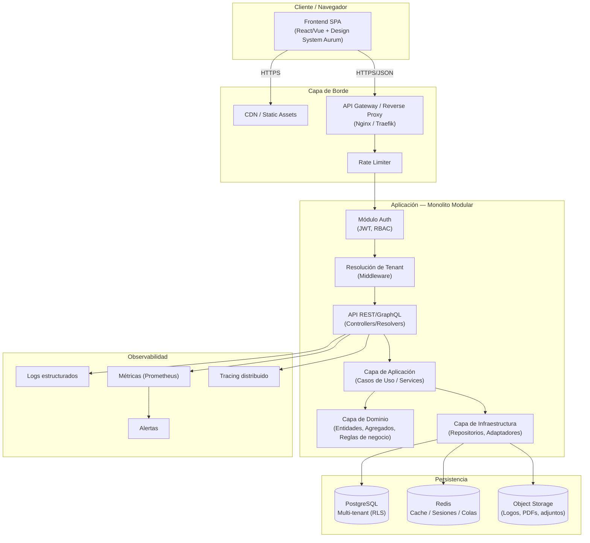
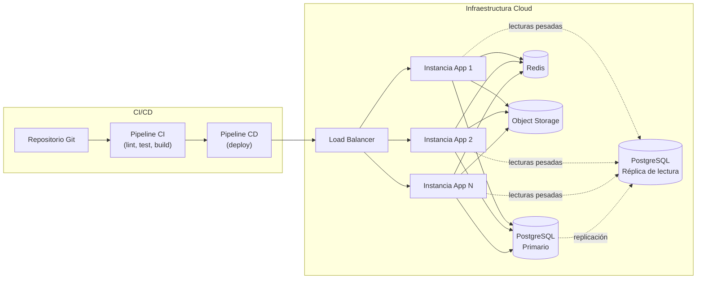
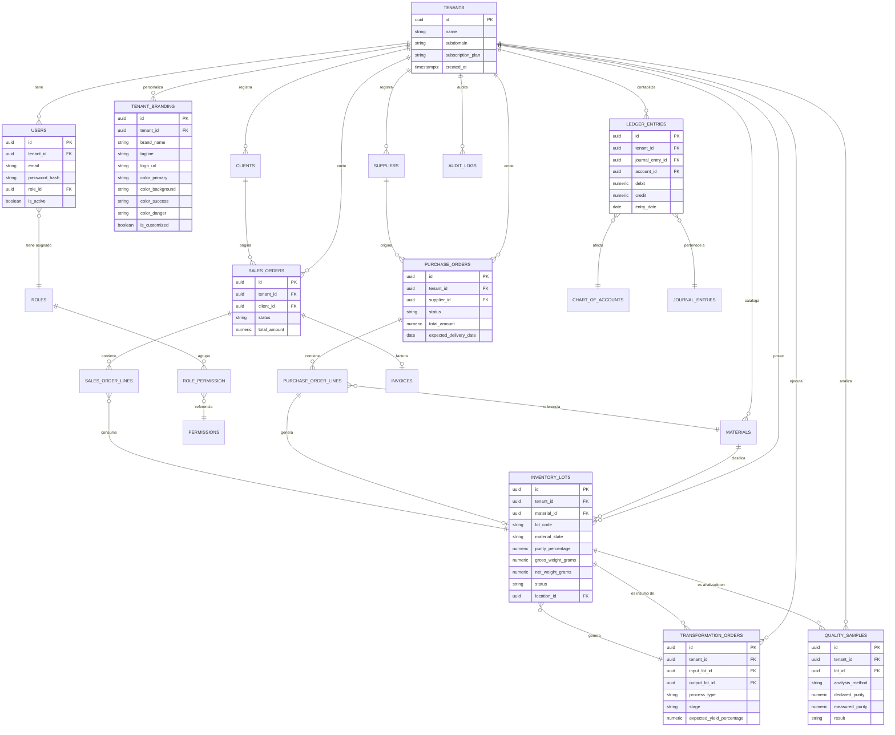
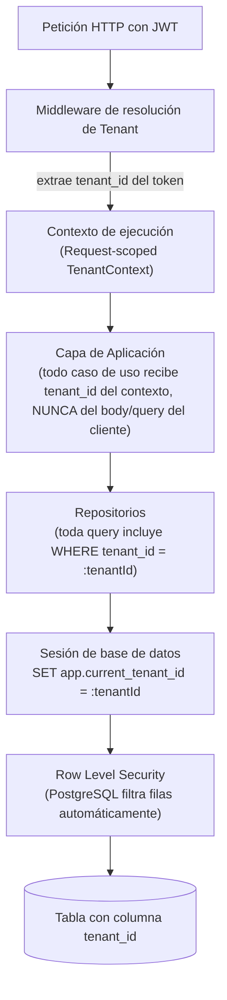
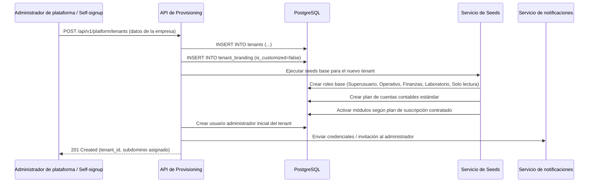
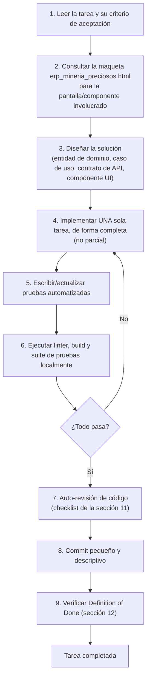

# IMPLEMENTACIÓN_AURUM_ERP.md
## Guía Maestra de Implementación — Sistema AURUM ERP

> **Documento de gobierno técnico** para la construcción del sistema AURUM ERP: una plataforma multi-tenant de gestión empresarial (ERP) especializada en compañías de minería y comercialización de metales preciosos (compra, venta y transformación de materiales crudos y refinados).
>
> Este documento es la **fuente única de verdad del proceso de desarrollo**. Claude Code (o cualquier equipo de ingeniería) debe seguirlo de manera secuencial, sin saltarse fases, y debe consultarlo antes de iniciar cualquier tarea de implementación.

---

### Metadatos del documento

| Campo | Valor |
|---|---|
| Proyecto | AURUM ERP |
| Tipo de sistema | ERP Multi-Tenant SaaS — Vertical Minería de Metales Preciosos |
| Referencia visual oficial | `erp_mineria_preciosos.html` |
| Motor de base de datos | PostgreSQL |
| Audiencia del documento | Claude Code / equipo de ingeniería de software |
| Estado | Vigente — guía de ejecución activa |
| Idioma de trabajo | Español (código, comentarios y nombres técnicos en inglés salvo dominio de negocio) |

---

## Índice

1. [Visión general del proyecto](#1-visión-general-del-proyecto)
2. [Punto de partida del proyecto](#2-punto-de-partida-del-proyecto)
3. [Arquitectura del sistema](#3-arquitectura-del-sistema)
4. [Diseño de la base de datos](#4-diseño-de-la-base-de-datos)
5. [Arquitectura multi-tenant](#5-arquitectura-multi-tenant)
6. [Fases de desarrollo](#6-fases-de-desarrollo)
7. [Módulos del ERP](#7-módulos-del-erp)
8. [Metodología de desarrollo](#8-metodología-de-desarrollo)
9. [Control de calidad](#9-control-de-calidad)
10. [Seguridad](#10-seguridad)
11. [Buenas prácticas](#11-buenas-prácticas)
12. [Definición de Finalización (DoD)](#12-definición-de-finalización-definition-of-done)
13. [Anexos](#13-anexos)

---

## 1. Visión general del proyecto

### 1.1 Objetivos del sistema

AURUM ERP tiene como objetivo central ofrecer una plataforma de gestión empresarial integral, especializada en el ciclo de negocio de compañías mineras y comercializadoras de metales preciosos (oro, plata, platino, paladio), cubriendo tanto materiales **crudos** (sin refinar) como **transformados/refinados**.

Objetivos específicos:

- **O1 — Trazabilidad total del material**: permitir seguir cada lote desde su origen (mina/proveedor) hasta su venta final, pasando por análisis de calidad y procesos de transformación.
- **O2 — Gestión financiera completa**: soportar el ciclo contable completo (CxC, CxP, libro mayor, balance general) con datos derivados de las operaciones reales del negocio (compras, ventas, transformaciones).
- **O3 — Multi-tenencia desde el diseño**: permitir que múltiples empresas (tenants) utilicen la misma instancia del sistema de forma aislada, segura y personalizable, sin necesidad de despliegues separados por cliente.
- **O4 — Personalización por empresa suscriptora**: cada tenant debe poder personalizar nombre, logo, eslogan y paleta de colores del sistema, manteniendo como comportamiento por defecto la identidad visual de Aurum ERP cuando no se ha personalizado nada.
- **O5 — Escalabilidad comercial (SaaS)**: el sistema debe poder crecer en número de tenants, usuarios y volumen transaccional sin rediseño arquitectónico.
- **O6 — Fidelidad de experiencia de usuario**: la experiencia visual e interactiva debe mantenerse fiel a la maqueta de referencia `erp_mineria_preciosos.html`, evolucionándola hacia una aplicación productiva sin perder su identidad.

### 1.2 Alcance funcional

El sistema cubre, como mínimo, los siguientes dominios funcionales (detallados en la sección 7):

| Dominio | Resumen |
|---|---|
| Autenticación y usuarios | Login, sesiones, roles, permisos |
| Gestión de empresas (tenants) | Alta, configuración y administración de empresas suscriptoras |
| Clientes y Proveedores | Directorios con ficha 360°, historial y trazabilidad comercial |
| Inventario | Lotes de material crudo y refinado, pureza, ubicación, valorización |
| Compras | Órdenes de compra, aprobación, recepción |
| Ventas | Órdenes de venta, cotizaciones, facturación |
| Transformación / Refinación | Pipeline de procesos (recepción → análisis → fundición → refinado → certificación) |
| Calidad / Laboratorio | Registro de muestras, métodos de análisis, aprobación/rechazo |
| Contabilidad | Libro mayor (partida doble), balance general, CxC/CxP |
| Reportes | Generación de reportes operativos, financieros y regulatorios |
| Dashboard | KPIs en tiempo real, alertas, pipeline visual, precios spot |
| Configuración | Apariencia/marca por tenant, módulos activos, parámetros de negocio |
| Auditoría | Registro inmutable de cambios y accesos críticos |
| API pública | Exposición de funcionalidades para integraciones externas |

Fuera de alcance en la primera versión (a menos que se documente lo contrario): integraciones bancarias directas, nómina electrónica gubernamental, módulo de Recursos Humanos extendido (se incluye una base mínima, ver sección 7.14), inteligencia artificial predictiva de precios.

### 1.3 Principios de arquitectura

1. **Clean Architecture**: separación estricta entre dominio, aplicación, infraestructura y presentación. El núcleo de negocio no depende de frameworks, bases de datos ni UI.
2. **Domain-Driven Design (DDD) táctico**: entidades, agregados, value objects y servicios de dominio para los módulos con mayor complejidad de negocio (Inventario, Transformación, Contabilidad).
3. **Multi-tenant by design**: el `tenant_id` (o equivalente de aislamiento) es un concepto de primera clase desde el modelo de datos hasta la capa de presentación.
4. **API-first**: toda funcionalidad de negocio se expone primero como API; el frontend es un consumidor de esa API, nunca una fuente de lógica de negocio.
5. **Fidelidad visual gobernada**: la maqueta `erp_mineria_preciosos.html` es la referencia de UI/UX. Cualquier desviación visual requiere justificación técnica documentada (ver sección 2.5).
6. **Evolución incremental verificable**: cada fase y cada tarea deben dejar el sistema en un estado compilable, probado y desplegable (ver sección 6 y 12).
7. **Seguridad por defecto**: ningún dato cruza límites de tenant sin pasar por una validación explícita de autorización.

### 1.4 Requisitos funcionales y no funcionales

#### 1.4.1 Requisitos funcionales (resumen — el detalle vive en la sección 7)

| ID | Requisito |
|---|---|
| RF-01 | El sistema debe permitir el registro y autenticación de usuarios por empresa (tenant). |
| RF-02 | El sistema debe permitir gestionar lotes de material crudo y refinado con trazabilidad completa. |
| RF-03 | El sistema debe permitir registrar compras y ventas de metales preciosos, con cálculo automático de valor según peso, pureza y precio de mercado. |
| RF-04 | El sistema debe permitir registrar procesos de transformación (refinación, fundición, laminado, etc.) y vincularlos a lotes de entrada y salida. |
| RF-05 | El sistema debe permitir el registro de análisis de laboratorio (pureza medida vs. declarada) con aprobación/rechazo de lotes. |
| RF-06 | El sistema debe generar asientos contables de doble partida derivados de las operaciones de negocio. |
| RF-07 | El sistema debe permitir generar reportes operativos, financieros y regulatorios exportables (PDF/Excel). |
| RF-08 | El sistema debe permitir a cada tenant personalizar su identidad visual (nombre, logo, colores), con un tema por defecto del sistema si no se personaliza. |
| RF-09 | El sistema debe permitir activar/desactivar módulos por tenant según su plan de suscripción. |
| RF-10 | El sistema debe registrar auditoría de operaciones críticas (creación, modificación, eliminación, accesos). |

#### 1.4.2 Requisitos no funcionales

| ID | Categoría | Requisito | Métrica objetivo |
|---|---|---|---|
| RNF-01 | Rendimiento | Tiempo de respuesta de endpoints transaccionales | P95 < 300 ms |
| RNF-02 | Rendimiento | Tiempo de carga inicial del dashboard | < 2.5 s en banda ancha estándar |
| RNF-03 | Disponibilidad | Uptime del servicio en producción | ≥ 99.5% mensual |
| RNF-04 | Escalabilidad | Soporte de tenants concurrentes sin degradación | ≥ 500 tenants activos por clúster base |
| RNF-05 | Seguridad | Aislamiento de datos entre tenants | 0 fugas de datos cruzadas (verificado por pruebas) |
| RNF-06 | Mantenibilidad | Cobertura mínima de pruebas automatizadas | ≥ 80% en capa de dominio/aplicación |
| RNF-07 | Usabilidad | Fidelidad visual respecto a la maqueta de referencia | Validación manual + checklist por pantalla |
| RNF-08 | Observabilidad | Trazabilidad de errores en producción | 100% de errores 5xx loggeados con contexto de tenant/usuario |
| RNF-09 | Portabilidad | Despliegue reproducible | Infraestructura como código, entorno reconstruible desde cero |
| RNF-10 | Localización | Soporte multi-idioma y multi-moneda a nivel de configuración | Configurable por tenant (ver módulo Configuración) |

---

## 2. Punto de partida del proyecto

### 2.1 Fuente oficial de referencia

El archivo **`erp_mineria_preciosos.html`** es la **única fuente oficial de referencia visual y funcional** para el desarrollo de AURUM ERP. Es un prototipo funcional de alta fidelidad (HTML + CSS + JavaScript vanilla, sin frameworks, sin dependencias externas salvo Google Fonts) que ya materializa:

- La estructura completa de navegación (sidebar + topbar + páginas).
- Los 11 módulos funcionales principales y su contenido de pantalla.
- El sistema visual completo (paleta de colores, tipografía, componentes: KPI cards, tablas, badges, modales, drawers, tabs, pipeline visual, ticker de precios).
- Un sistema de personalización de marca (branding) funcional con persistencia en `localStorage`, que es el antecedente directo del sistema de personalización multi-tenant que debe implementarse en producción (ver sección 5).

> **Regla de oro:** antes de escribir una sola línea de código de producción, Claude Code debe haber leído y comprendido **completamente** el archivo `erp_mineria_preciosos.html` — su HTML, su CSS y su JavaScript — incluyendo cada módulo, cada modal, cada estado visual y cada interacción.

### 2.2 Checklist de análisis previo obligatorio

Antes de iniciar el desarrollo, Claude Code debe completar y dejar constancia (en un documento de análisis o en comentarios de planeación) de los siguientes puntos:

- [ ] Inventario completo de páginas (`page-*`) y su propósito de negocio.
- [ ] Inventario completo de modales (`modal-*`) y los formularios que contienen.
- [ ] Inventario de componentes visuales reutilizables (KPI card, panel, badge, tabla, tab-bar, drawer, pipeline, ticker).
- [ ] Extracción de la paleta de colores y variables CSS (`:root`) como base del Design System.
- [ ] Mapeo de la navegación (sidebar → página → subtítulo) como base del enrutamiento real.
- [ ] Identificación de los flujos de datos simulados (arrays JS embebidos) que deben convertirse en entidades de dominio reales.
- [ ] Identificación del sistema de branding (`localStorage`, CSS custom properties en `:root`) como base conceptual del sistema de personalización multi-tenant.
- [ ] Identificación de patrones de interacción (apertura de modal, apertura de drawer, cambio de tab, navegación SPA) que deben traducirse a patrones idiomáticos del framework elegido.

### 2.3 Estructura de referencia detectada en la maqueta

La tabla siguiente documenta el inventario real extraído de `erp_mineria_preciosos.html`, y debe usarse como mapa de navegación para el desarrollo modular:

| Página (`id`) | Módulo de negocio | Componentes clave presentes en la maqueta |
|---|---|---|
| `page-dashboard` | Dashboard | KPI cards, ticker de precios spot (XAU/XAG/XPT/XPD), tabla de transacciones recientes, panel de alertas, grid de materiales en stock, pipeline de transformación, lista de ubicaciones/minas |
| `page-inventario` | Inventario | KPI cards, tabs (Todos/Crudos/Refinados/Cuarentena), tabla de lotes con pureza/peso/ubicación/estado |
| `page-compras` | Compras | KPI cards, tabla de órdenes de compra con flujo de aprobación |
| `page-ventas` | Ventas | KPI cards, tabla de órdenes de venta con estado de facturación |
| `page-transformacion` | Transformación | KPI cards, pipeline visual de 5 etapas, tabla de órdenes de transformación |
| `page-calidad` | Calidad / Laboratorio | KPI cards, tabla de muestras con pureza declarada vs. medida |
| `page-proveedores` | Proveedores | KPI cards, tabla clicable → drawer de ficha 360° |
| `page-clientes` | Clientes | KPI cards, tabla clicable → drawer de ficha 360° |
| `page-finanzas` | Contabilidad | Tabs (CxC/CxP, Libro Mayor, Balance General) |
| `page-reportes` | Reportes | Grid de tarjetas de reporte → vista previa generada dinámicamente |
| `page-configuracion` | Configuración | Tabs (Apariencia/Marca, Módulos, Parámetros, Usuarios y Roles) |

| Modal (`id`) | Propósito |
|---|---|
| `modal-transaccion` | Registro rápido de compra/venta desde el topbar |
| `modal-lote` | Registro de nuevo lote de inventario |
| `modal-compra` | Nueva orden de compra |
| `modal-venta` | Nueva orden de venta |
| `modal-transformacion` | Nueva orden de transformación |
| `modal-muestra` | Registro de muestra de laboratorio |
| `modal-proveedor` | Alta de proveedor |
| `modal-cliente` | Alta de cliente |
| `modal-asiento` | Nuevo asiento contable manual |
| `modal-usuario` | Alta de usuario con asignación de rol y módulos |

### 2.4 Design System extraído de la maqueta (base del sistema de tokens)

```css
/* Paleta base — Tema "Aurum" (default del sistema) */
--gold:        #C9A84C;  /* Acento primario */
--gold-light:  #E8C96A;  /* Hover / variantes claras */
--gold-dim:    #7A6228;  /* Variantes oscuras / degradados */
--bg-deep:     #0A0A0B;  /* Fondo base de la aplicación */
--bg-panel:    #13131A;  /* Fondo de paneles internos */
--bg-card:     #1A1A24;  /* Fondo de tarjetas */
--bg-hover:    #22222E;  /* Estado hover */
--border:      #2A2A38;  /* Bordes neutros */
--border-gold: rgba(201,168,76,0.3); /* Bordes de énfasis */
--text-primary:   #F0EDE8;
--text-secondary: #8A8A9A;
--text-dim:       #4A4A5A;
--green: #3DAA6E;  /* Éxito / positivo */
--red:   #D45454;  /* Alerta / negativo */
--blue:  #4A7CC7;  /* Información / en proceso */
```

Tipografías: `Inter` (texto general, pesos 300–900) y `Space Grotesk` (cifras, datos monoespaciados, branding).

Estos valores deben convertirse en el **archivo de tokens de diseño** (`design-tokens.json` / variables de Tailwind / tema de la librería de componentes elegida) y constituyen el tema por defecto (`default theme`) del sistema multi-tenant de personalización (sección 5.6 y módulo Configuración, sección 7.17).

### 2.5 Reglas de fidelidad y desviación visual

1. La maqueta es la **referencia de UI/UX**, no el código final. **No se debe copiar el HTML de forma literal** cuando ello contradiga las buenas prácticas del framework elegido (componentización, accesibilidad, responsividad real, gestión de estado).
2. Toda pantalla nueva del sistema productivo debe poder mapearse a una pantalla, sección o patrón ya existente en la maqueta. Si una pantalla nueva no tiene equivalente en la maqueta, debe diseñarse **siguiendo el mismo Design System** (sección 2.4) y debe documentarse en un registro de decisiones de diseño (`docs/decisiones-diseno.md`).
3. Cualquier desviación del diseño original (cambio de paleta, de layout, de componente) requiere:
   - Justificación técnica o de negocio explícita.
   - Registro en el changelog de decisiones (ver sección 9.7).
   - Aprobación implícita por cumplir el checklist de la sección 12 (Definition of Done), que exige coherencia visual con la maqueta.
4. El sistema de personalización de marca por tenant (ver sección 5.6) **no constituye una desviación**: es una funcionalidad explícitamente requerida y ya prototipada en la maqueta (módulo Configuración → Apariencia/Marca). El tema "Aurum" de la maqueta es el tema **por defecto** que debe verse cuando un tenant no ha personalizado nada.

---

## 3. Arquitectura del sistema

### 3.1 Arquitectura general

AURUM ERP se construye como un **monolito modular** en su primera etapa (no microservicios), organizado internamente con **Clean Architecture** por capas y **módulos verticales por dominio de negocio**. Esta decisión prioriza velocidad de desarrollo y simplicidad operativa, dejando puertas abiertas para extraer servicios independientes en el futuro (ver 3.9 Escalabilidad) si un módulo concreto (p. ej. Reportes o Contabilidad) requiere escalar de forma independiente.



### 3.2 Backend

- **Lenguaje/Framework seleccionado**: **Python 3.12+ con FastAPI** (ver ADR `docs/adr/0001-stack-tecnologico.md`). FastAPI ofrece tipado fuerte vía type hints + Pydantic, inyección de dependencias nativa (`Depends`), documentación OpenAPI automática y rendimiento async (ASGI). Frameworks alternativos válidos si el negocio lo justificara: Django REST, Litestar.
- **Organización por capas** (de afuera hacia adentro):
  1. **Presentación** (`presentation/`: routers de FastAPI, esquemas Pydantic de entrada/salida, dependencias de ruta).
  2. **Aplicación** (`application/`: casos de uso / *application services*): orquesta el dominio, no contiene reglas de negocio propias.
  3. **Dominio** (`domain/`): entidades, value objects, agregados, interfaces de repositorio (puertos, vía `Protocol`/`ABC`), eventos de dominio, reglas de negocio puras (sin dependencias externas, Python "puro").
  4. **Infraestructura** (`infrastructure/`): implementaciones de repositorios (SQLAlchemy 2.0), adaptadores externos (storage, email, precios spot), configuración de PostgreSQL/Redis.
- **Regla de dependencia**: el dominio no importa nada de infraestructura ni de framework (ni SQLAlchemy, ni FastAPI, ni Pydantic en la capa de dominio puro). La infraestructura implementa interfaces (puertos) definidas por el dominio (Dependency Inversion — principio "D" de SOLID).
- **Organización por módulo de negocio**: cada módulo del ERP (sección 7) es un **paquete Python** (`modules/inventory/`, `modules/purchasing/`, `modules/sales/`, etc.) con sus subpaquetes `domain/`, `application/`, `infrastructure/`, `presentation/`. Cada módulo expone su `APIRouter` y se ensambla en la app principal. Los nombres lógicos `AuthModule`, `InventoryModule`, etc. usados en el resto del documento se refieren a estos paquetes.

### 3.3 Frontend

- **Framework seleccionado**: **React 18 + Vite + TypeScript estricto** (Vite como build tool y dev server por su velocidad y HMR; ver ADR `docs/adr/0001-stack-tecnologico.md`).
- **Gestión de estado**: estado de servidor con TanStack Query (React Query) + estado de UI local con stores ligeros (Zustand) o Context API para lo estrictamente necesario (tema activo del tenant, sesión, sidebar colapsado).
- **Componentización derivada de la maqueta**: cada patrón visual de `erp_mineria_preciosos.html` se traduce a un componente reutilizable y tipado. Ver tabla de mapeo completa en el Anexo 13.2.
- **Routing**: enrutador de la SPA (React Router / Vue Router) reemplazando la función `navigate()` por rutas reales (`/dashboard`, `/inventario`, `/compras`, etc.), preservando el mismo mapa de navegación que la maqueta.
- **Theming dinámico**: las variables CSS (`:root`) de la maqueta se implementan como **CSS Custom Properties inyectadas en runtime** a partir de la configuración de branding del tenant activo (ver sección 5.6), exactamente como ya se prototipó en `erp_mineria_preciosos.html` con `document.documentElement.style.setProperty(...)`.
- **Accesibilidad**: todos los componentes nuevos deben cumplir WCAG 2.1 AA como mínimo (contraste, foco visible, roles ARIA en modales/drawers), mejorando sobre la maqueta original donde sea necesario.

### 3.4 API

- **Estilo**: API REST como estándar principal (recursos por módulo: `/api/v1/inventory/lots`, `/api/v1/purchases/orders`, etc.). Se permite evaluar GraphQL (vía Strawberry) como capa complementaria para el Dashboard (agregaciones de KPIs) en fases posteriores, sin que sea un requisito de la v1.
- **Versionado**: versionado explícito en la URL (`/api/v1/...`) desde el primer endpoint (un `APIRouter` raíz con prefijo `/api/v1`).
- **Contrato**: cada endpoint documentado con OpenAPI, **generado automáticamente por FastAPI** a partir de los esquemas Pydantic y las firmas de los path operations; UI navegable en `/docs` (Swagger UI) y `/redoc` (ver sección 9.6).
- **Convenciones**:
  - Sustantivos en plural para colecciones (`/clients`, `/suppliers`, `/lots`).
  - Verbos HTTP estándar (GET/POST/PUT/PATCH/DELETE); evitar verbos en la URL salvo acciones de negocio no-CRUD (`POST /purchase-orders/{id}/approve`).
  - Paginación basada en cursor o `page`/`limit` consistente en todos los listados (alineado con las tablas de la maqueta).
  - Respuestas de error estandarizadas (`{ statusCode, error, message, traceId }`).
- **Multi-tenant en la API**: el `tenant_id` nunca se recibe como parámetro libre del cliente para operaciones de lectura/escritura de datos de negocio; se resuelve desde el token de autenticación o el dominio/subdominio de la petición (ver sección 5).

### 3.5 Base de datos

Ver desarrollo completo en la sección 4. Resumen arquitectónico: PostgreSQL como motor único, con aislamiento multi-tenant basado en **columna `tenant_id` + Row Level Security (RLS)** (estrategia "shared database, shared schema", ver sección 5.1).

### 3.6 Infraestructura



- **Contenerización**: toda la aplicación (backend, frontend de build estático, jobs) se empaqueta en contenedores Docker desde el día uno, con `docker-compose` para entornos locales y de desarrollo.
- **Entornos**: `local`, `development`, `staging`, `production`, estrictamente separados, con bases de datos y secretos independientes.
- **Infraestructura como código**: definición declarativa (Terraform / Pulumi) de los recursos cloud (cómputo, base de datos, redes, almacenamiento).
- **Despliegue**: estrategia de despliegue sin downtime (rolling update / blue-green) una vez el sistema esté en `staging`/`production`.

### 3.7 Seguridad

Tratada en detalle en la sección 10. A nivel arquitectónico: autenticación basada en JWT de corta duración + refresh tokens, autorización RBAC con permisos granulares por módulo, y aislamiento estricto de tenants reforzado en tres capas: aplicación (filtros explícitos), base de datos (RLS) y pruebas automatizadas de fuga de datos.

### 3.8 Escalabilidad

- **Escalabilidad horizontal de la capa de aplicación**: instancias sin estado (stateless) detrás de un balanceador de carga; la sesión vive en JWT + Redis, no en memoria local del proceso.
- **Escalabilidad de base de datos**: réplicas de lectura para reportes y dashboards (consultas pesadas de agregación) separadas del tráfico transaccional; particionamiento de tablas de alto volumen (asientos contables, auditoría) por rango de fecha cuando el volumen lo justifique.
- **Cache**: Redis para resultados de KPIs del dashboard, precios spot de metales (con TTL corto), y sesiones.
- **Colas de trabajo asíncronas**: generación de reportes pesados (PDF/Excel), envío de notificaciones y procesamiento de webhooks se desacoplan vía colas (**ARQ** sobre Redis; Celery como alternativa madura) para no bloquear el ciclo de eventos ASGI.
- **Camino de evolución a microservicios**: si un módulo (p. ej. Reportes o Contabilidad) requiere escalar de forma independiente del resto, su límite ya está definido por el paquete Python / Clean Architecture correspondiente, facilitando su extracción sin reescritura del dominio.

### 3.9 Observabilidad

- **Logging estructurado**: formato JSON, con `tenant_id`, `user_id`, `request_id`/`trace_id` en cada línea de log relevante.
- **Métricas**: exposición de métricas técnicas (latencia, tasa de error, throughput) y de negocio (transacciones por tenant, valor transaccionado) vía Prometheus/Grafana.
- **Tracing distribuido**: correlación de peticiones HTTP → casos de uso → consultas a base de datos mediante un `trace_id` propagado en cada capa (OpenTelemetry).
- **Alertas**: umbrales definidos para tasa de error 5xx, latencia P95, saturación de conexiones a base de datos y fallos de jobs en cola.
- **Auditoría de negocio**: ver módulo de Auditoría (sección 7.18) — complementa, pero no sustituye, la observabilidad técnica.

---

## 4. Diseño de la base de datos

### 4.1 Motor y principios generales

- **Motor**: PostgreSQL 15+ (obligatorio, ver requisito explícito del proyecto).
- **Normalización**: diseño normalizado hasta 3FN (Tercera Forma Normal) como punto de partida en todas las tablas transaccionales; se permite desnormalización controlada y documentada únicamente en tablas de reporting/agregación (p. ej. vistas materializadas para el Dashboard).
- **Multi-tenant a nivel de esquema**: todas las tablas de negocio incluyen `tenant_id` (ver desarrollo completo en sección 5).
- **Identificadores**: `UUID` (tipo `uuid`, generado con `gen_random_uuid()` vía extensión `pgcrypto`/`uuid-ossp`) como clave primaria de todas las tablas de negocio, para evitar colisiones entre tenants y facilitar particionamiento futuro. Se evita `SERIAL`/`BIGSERIAL` autoincremental como PK pública.
- **Soft delete**: las entidades de negocio relevantes (clientes, proveedores, lotes, usuarios) usan `deleted_at TIMESTAMPTZ NULL` en lugar de borrado físico, preservando trazabilidad histórica.
- **Timestamps de auditoría base**: toda tabla de negocio incluye como mínimo `created_at`, `updated_at` (gestionados por trigger o por la capa de aplicación) y `created_by`, `updated_by` (referencia a usuario).

### 4.2 Convenciones de nombres

| Elemento | Convención | Ejemplo |
|---|---|---|
| Tablas | `snake_case`, plural, en inglés | `purchase_orders`, `quality_samples` |
| Columnas | `snake_case`, en inglés | `purity_percentage`, `gross_weight_grams` |
| Claves primarias | `id` (tipo `uuid`) | `id` |
| Claves foráneas | `<entidad_singular>_id` | `tenant_id`, `supplier_id`, `material_id` |
| Tablas pivote (N:M) | `<entidad1>_<entidad2>` en singular | `role_permission` |
| Índices | `idx_<tabla>_<columna(s)>` | `idx_inventory_lots_tenant_id` |
| Índices únicos | `uq_<tabla>_<columna(s)>` | `uq_users_tenant_id_email` |
| Claves foráneas (constraint) | `fk_<tabla>_<tabla_referenciada>` | `fk_purchase_orders_suppliers` |
| Checks | `chk_<tabla>_<regla>` | `chk_inventory_lots_purity_range` |
| Enums (tipos) | `<entidad>_status_enum` | `purchase_order_status_enum` |
| Esquemas | `public` para catálogo/plataforma; `tenant_shared` si se requiere esquema compartido adicional | — |

### 4.3 Modelo de datos — diagrama entidad-relación (núcleo)



> Este diagrama representa el **núcleo** del modelo. El detalle completo de tablas por módulo (catálogo de cuentas contables, líneas de factura, permisos granulares, configuración de módulos por tenant, etc.) se desarrolla durante la Fase 2 en adelante (sección 6) y debe documentarse en `docs/database/schema.md`, manteniendo siempre las convenciones de la sección 4.2.

### 4.4 Estrategia de migraciones

- **Herramienta**: migraciones gestionadas con **Alembic** (sobre los modelos SQLAlchemy), **nunca** modificación manual directa del esquema en entornos compartidos. Las políticas RLS y demás DDL no autogenerable se escriben a mano dentro de la migración correspondiente.
- **Una migración por cambio atómico de esquema**: no se agrupan cambios no relacionados en una sola revisión.
- **Migraciones reversibles**: toda revisión debe implementar `upgrade()` y `downgrade()` cuando sea técnicamente posible; si una migración es irreversible (p. ej. borrado de columna con datos), debe documentarse explícitamente por qué.
- **Nomenclatura de archivos de migración**: Alembic configurado con `file_template = %%(year)d%%(month).2d%%(day).2d%%(hour).2d%%(minute).2d_%%(slug)s` (timestamp + descripción en snake_case), garantizando orden cronológico determinista además del `down_revision` encadenado.
- **Migraciones en pipeline CI/CD**: las migraciones se ejecutan de forma automatizada y controlada en cada despliegue a `staging`/`production`, nunca manualmente contra producción.
- **Seeds separados de migraciones**: los datos de catálogo (roles base, permisos base, plan de cuentas contables estándar, tema "Aurum" por defecto) se gestionan con scripts de *seed* idempotentes, separados de las migraciones de esquema.

### 4.5 Índices

Reglas generales de indexación:

| Caso | Regla |
|---|---|
| Toda FK | Índice por defecto sobre cada columna de clave foránea (`tenant_id`, `supplier_id`, `material_id`, etc.) |
| Multi-tenant | Índice compuesto `(tenant_id, <columna_busqueda_frecuente>)` en tablas de alto volumen (p. ej. `(tenant_id, status)` en `purchase_orders`) |
| Búsquedas de texto | Índice `GIN` con `pg_trgm` para búsquedas parciales en nombres de clientes/proveedores (autocompletado) |
| Unicidad lógica por tenant | Índice único compuesto `(tenant_id, email)` en usuarios, `(tenant_id, lot_code)` en lotes, en lugar de unicidad global |
| Rangos de fecha | Índice sobre columnas de fecha usadas en reportes (`entry_date`, `created_at`) cuando el volumen lo justifique |
| Particionamiento (futuro) | Tablas de alto volumen histórico (`ledger_entries`, `audit_logs`) candidatas a particionamiento declarativo por rango de fecha cuando superen el umbral definido en pruebas de carga |

### 4.6 Optimización de consultas

- Uso de `EXPLAIN ANALYZE` obligatorio antes de aprobar cualquier consulta identificada como "pesada" (reportes, dashboards, agregaciones de KPIs).
- Vistas materializadas para KPIs del Dashboard que no requieren tiempo real estricto (refrescadas por job programado), evitando recalcular agregaciones pesadas en cada petición.
- Evitar el problema N+1 en el ORM mediante `joins`/`relations` explícitas o *data loaders* en los listados con relaciones (p. ej. lotes con su material y ubicación).
- Paginación obligatoria en todo endpoint de listado; prohibido exponer un endpoint que devuelva una tabla completa sin límite.
- *Connection pooling* configurado explícitamente (pool nativo de SQLAlchemy; PgBouncer en modo `transaction` delante de PostgreSQL en producción) dimensionado según el número de instancias de aplicación. Nota: con PgBouncer en modo `transaction`, el `SET app.current_tenant_id` para RLS debe ejecutarse con `SET LOCAL` dentro de la transacción (ver 5.5).

### 4.7 Auditoría a nivel de datos

- Tabla `audit_logs` (detallada en el módulo de Auditoría, sección 7.18) que registra: tenant, usuario, entidad afectada, tipo de operación, valores anteriores/nuevos (JSONB), timestamp, IP/origen.
- Disparadores (`triggers`) de PostgreSQL opcionales para capturar cambios en tablas especialmente sensibles (asientos contables, usuarios, configuración de branding) como mecanismo de respaldo adicional a la auditoría de aplicación.
- Los registros de auditoría son **append-only**: no se actualizan ni se eliminan mediante operaciones normales de la aplicación.

### 4.8 Respaldo y recuperación

- **Backups completos** automatizados diarios de toda la base de datos (`pg_dump` o snapshot del proveedor cloud), con retención mínima de 30 días.
- **WAL (Write-Ahead Log) archiving** habilitado para permitir *Point-In-Time Recovery (PITR)*.
- **Pruebas periódicas de restauración**: un backup que nunca se ha probado a restaurar se considera no confiable; se debe ejecutar un simulacro de recuperación al menos una vez por trimestre en `staging`.
- **RPO/RTO objetivo** (a definir y documentar con el negocio antes de producción): referencia inicial sugerida RPO ≤ 15 minutos, RTO ≤ 2 horas.
- **Aislamiento de respaldo por entorno**: los backups de producción nunca se restauran sobre `staging`/`development` sin anonimización previa de datos sensibles de tenants reales.

---

## 5. Arquitectura Multi-Tenant

El soporte multi-tenant **no es una capa añadida después**: es una decisión de diseño que atraviesa el modelo de datos, la capa de aplicación, la API y el frontend desde la primera línea de código.

### 5.1 Estrategia de multi-tenant seleccionada

Se adopta la estrategia **"Shared Database, Shared Schema" con discriminador `tenant_id`**, reforzada con **Row Level Security (RLS) nativo de PostgreSQL**.

Justificación frente a las alternativas:

| Estrategia | Descripción | Decisión |
|---|---|---|
| Base de datos separada por tenant | Máximo aislamiento, máximo costo operativo y de mantenimiento de migraciones | Descartada para v1 (posible evolución para tenants "enterprise" en el futuro, ver 5.9) |
| Esquema separado por tenant (mismo DB) | Aislamiento medio, complejidad alta en migraciones (N esquemas a migrar) | Descartada para v1 |
| **Esquema compartido + columna `tenant_id` + RLS** | Balance óptimo costo/aislamiento/operación para el volumen esperado (RNF-04: ≥500 tenants) | **Seleccionada** |

### 5.2 Aislamiento de datos entre tenants

El aislamiento se garantiza en **tres capas independientes**, de forma que el fallo de una no comprometa el sistema (defensa en profundidad):



1. **Capa de aplicación**: ningún repositorio ni caso de uso acepta `tenant_id` como parámetro libre proveniente del cliente; siempre se inyecta desde un `TenantContext` resuelto por middleware a partir del JWT validado.
2. **Capa de base de datos (RLS)**: política de seguridad a nivel de fila que filtra automáticamente cualquier consulta, **incluso si un repositorio tuviera un bug y olvidara el filtro explícito**.
3. **Pruebas automatizadas de fuga de datos**: suite de pruebas de integración dedicada (ver 9.3) que verifica explícitamente que el usuario del Tenant A nunca puede leer/escribir datos del Tenant B, ni siquiera manipulando IDs en las peticiones.

### 5.3 Seguridad entre tenants

- El `tenant_id` se determina **del lado del servidor**, nunca se confía en un `tenant_id` enviado por el cliente en body/query/headers para autorizar una operación de escritura o lectura de datos de negocio.
- Resolución del tenant soportada por dos mecanismos complementarios:
  - **Subdominio** (`empresa-x.aurumerp.com`) → resolución del tenant antes incluso de la autenticación, útil para aplicar el branding correcto en la pantalla de login.
  - **Claim dentro del JWT** (`tenant_id` firmado) → fuente de verdad para autorizar cada petición autenticada.
- Los identificadores expuestos en URLs (`/api/v1/inventory/lots/{id}`) son UUIDs no secuenciales, dificultando ataques de enumeración; aun así, **toda consulta por `id` se combina siempre con el filtro de `tenant_id`** (un UUID adivinado de otro tenant debe devolver 404, no 403, para no filtrar existencia).

### 5.4 Uso de `tenant_id` en todas las entidades de negocio

Regla obligatoria: **toda tabla que represente una entidad de negocio específica de una empresa suscriptora debe incluir la columna `tenant_id UUID NOT NULL REFERENCES tenants(id)`.**

Excepciones explícitas (tablas sin `tenant_id`, de catálogo global de plataforma):

- `tenants` (la propia tabla de tenants).
- `permissions` (catálogo global de permisos del sistema).
- `plans` (catálogo global de planes de suscripción).
- Tablas de configuración técnica de la plataforma (feature flags globales, versiones de esquema).

Todo lo demás —usuarios, roles (si son personalizables por tenant), clientes, proveedores, materiales, lotes, órdenes, asientos contables, configuración de branding, auditoría— **incluye `tenant_id`**.

### 5.5 Políticas Row Level Security (RLS) en PostgreSQL

Patrón estándar a aplicar en **cada tabla de negocio**:

```sql
-- 1. Habilitar RLS en la tabla
ALTER TABLE inventory_lots ENABLE ROW LEVEL SECURITY;
ALTER TABLE inventory_lots FORCE ROW LEVEL SECURITY; -- aplica incluso al propietario de la tabla

-- 2. Política de aislamiento por tenant
CREATE POLICY tenant_isolation_inventory_lots
  ON inventory_lots
  USING (tenant_id = current_setting('app.current_tenant_id')::uuid)
  WITH CHECK (tenant_id = current_setting('app.current_tenant_id')::uuid);

-- 3. La capa de infraestructura, al abrir cada transacción, ejecuta:
--    SET LOCAL app.current_tenant_id = '<uuid-del-tenant-resuelto>';
```

**Implementación en SQLAlchemy**: el `tenant_id` del `TenantContext` (request-scoped) se aplica al inicio de cada transacción con `SET LOCAL` (acotado a la transacción, seguro con PgBouncer en modo `transaction`). Se hace en un único punto central — un *dependency* de FastAPI que abre la `AsyncSession`/`begin()` y ejecuta `await session.execute(text("SET LOCAL app.current_tenant_id = :tid"), {"tid": str(tenant_id)})` — de modo que ningún repositorio individual pueda olvidarlo.

Reglas de gobierno asociadas:

- La política RLS se crea **en la misma migración (Alembic)** que crea la tabla (nunca como paso separado posterior, para evitar ventanas sin protección).
- El rol de base de datos usado por la aplicación **no** tiene el atributo `BYPASSRLS`.
- Un rol administrativo separado (con `BYPASSRLS`), usado **solo** para tareas operativas (migraciones, soporte excepcional auditado), nunca para tráfico de la aplicación.
- Pruebas de integración específicas verifican que las políticas RLS existen y funcionan para cada tabla nueva (checklist en Definition of Done, sección 12).

### 5.6 Gestión y administración de tenants — Personalización de marca

Este punto materializa en producción lo ya prototipado en `erp_mineria_preciosos.html` (módulo Configuración → Apariencia/Marca, sistema de `localStorage` + CSS Custom Properties).

- **Tabla `tenant_branding`** (1:1 con `tenants`): `brand_name`, `tagline`, `logo_url`, `color_primary`, `color_background`, `color_success`, `color_danger`, `is_customized boolean DEFAULT false`.
- **Comportamiento por defecto obligatorio**: si `is_customized = false` (o no existe registro), el frontend debe renderizar el **tema "Aurum" por defecto** descrito en la sección 2.4, exactamente igual a la maqueta de referencia.
- **Flujo de personalización**:
  1. El usuario administrador del tenant edita nombre, eslogan, logo y colores en el módulo Configuración → Apariencia/Marca (igual a la maqueta).
  2. Al guardar, se persiste en `tenant_branding` (no en `localStorage` del navegador — esa era una simulación válida solo para el prototipo).
  3. El backend expone esta configuración en un endpoint de bajo costo y cacheable (`GET /api/v1/tenants/me/branding`), consumido por el frontend al iniciar sesión y aplicado mediante CSS Custom Properties en el elemento raíz, igual que en la maqueta.
  4. Un botón "Restaurar tema del sistema" (ya presente en la maqueta) ejecuta `is_customized = false` y limpia los campos personalizados.
- **Carga de logo**: almacenado en Object Storage (no en base de datos como blob), con validación de tipo/tamaño de archivo y URL servida vía CDN.
- **Caché de branding**: dado que cambia con poca frecuencia, se cachea en Redis con invalidación explícita al guardar cambios.

### 5.7 Provisionamiento automático de nuevos tenants



Reglas de provisionamiento:

- El alta de un tenant es una **transacción atómica**: si falla cualquier paso (creación de roles base, plan de cuentas, usuario inicial), se revierte todo.
- Todo tenant nuevo nace con `tenant_branding.is_customized = false` (tema por defecto) y con el conjunto de módulos correspondiente a su plan de suscripción (ver módulo Configuración, sección 7.17).
- El proceso debe ser idempotente ante reintentos (uso de una clave de idempotencia en la petición de creación).

### 5.8 Migraciones por tenant

Dado que se usa esquema compartido (sección 5.1), **las migraciones de esquema se ejecutan una sola vez para todos los tenants** (no hay "N esquemas" que migrar individualmente). Sin embargo, deben gestionarse con cuidado los siguientes escenarios:

- **Migraciones de datos** (no solo de esquema) que deban poblar valores por tenant existente (p. ej. activar un módulo nuevo para todos los tenants de un plan determinado) se ejecutan como scripts de migración de datos, idempotentes, con capacidad de ejecutarse por lotes (*batching*) para no bloquear tablas con bajo tiempo de mantenimiento.
- **Feature flags por tenant**: para cambios de comportamiento que no deban aplicar inmediatamente a todos los tenants (rollout gradual de un módulo nuevo), se usa una tabla `tenant_feature_flags` en lugar de condicionar la migración misma.
- Ningún script de migración de datos puede asumir un número fijo de tenants ni iterar de forma no paginada sobre todos los tenants en memoria si el volumen es alto.

### 5.9 Escalabilidad horizontal del modelo multi-tenant

- El diseño "shared schema + RLS" escala horizontalmente añadiendo más instancias de aplicación (stateless) detrás del balanceador, sin relación 1:1 entre tenant e infraestructura.
- **Camino de evolución para tenants de alto volumen**: si en el futuro un tenant específico (plan "Enterprise") requiere aislamiento físico reforzado o rendimiento dedicado, la arquitectura permite migrar selectivamente ese tenant a una base de datos físicamente separada sin cambiar el modelo de dominio (el `tenant_id` ya es la frontera lógica; mover esa frontera a nivel físico es un cambio de infraestructura, no de dominio).
- Monitoreo por tenant (sección 3.9) permite identificar tenants "ruidosos" (alto volumen) candidatos a aislamiento dedicado antes de que afecten a otros tenants.

---

## 6. Fases de desarrollo

El desarrollo se organiza en **8 fases secuenciales**. Ninguna fase puede comenzar sin que la anterior cumpla su Definition of Done (sección 12). Esto es una regla dura, no una sugerencia.

```mermaid
flowchart LR
    F0["Fase 0<br/>Análisis y cimentación"] --> F1["Fase 1<br/>Fundaciones técnicas"]
    F1 --> F2["Fase 2<br/>Identidad, Tenants y Usuarios"]
    F2 --> F3["Fase 3<br/>Terceros: Clientes y Proveedores"]
    F3 --> F4["Fase 4<br/>Operación: Inventario, Compras, Ventas"]
    F4 --> F5["Fase 5<br/>Transformación y Calidad"]
    F5 --> F6["Fase 6<br/>Contabilidad y Tesorería"]
    F6 --> F7["Fase 7<br/>Reportes, Dashboard y Configuración avanzada"]
    F7 --> F8["Fase 8<br/>Auditoría, API pública y endurecimiento"]
```



### Fase 0 — Análisis y cimentación

| Aspecto | Detalle |
|---|---|
| **Objetivos** | Comprender exhaustivamente `erp_mineria_preciosos.html`; establecer el repositorio, las convenciones y el Design System base |
| **Entregables** | Documento de análisis de la maqueta (checklist sección 2.2 completo); repositorio inicializado con estructura de carpetas Clean Architecture; archivo de tokens de diseño extraído de la maqueta; `docker-compose` de entorno local funcional |
| **Dependencias** | Ninguna (punto de partida) |
| **Criterios de aceptación** | El checklist de la sección 2.2 está 100% completo y documentado; el entorno local levanta sin errores (`docker-compose up`); el linter y el formateador están configurados y pasan sobre un proyecto vacío |

### Fase 1 — Fundaciones técnicas

| Aspecto | Detalle |
|---|---|
| **Objetivos** | Dejar lista la infraestructura técnica transversal: conexión a PostgreSQL, motor de migraciones, esquema de logging, manejo global de errores, esqueleto de la API, esqueleto del frontend con routing y theming dinámico |
| **Entregables** | Migraciones iniciales (`tenants`, `tenant_branding`); middleware de resolución de tenant (sin lógica de negocio aún); shell de frontend con sidebar/topbar replicando la navegación de la maqueta (rutas vacías); pipeline CI ejecutando lint + test + build |
| **Dependencias** | Fase 0 completa |
| **Criterios de aceptación** | El proyecto compila y arranca en local y en CI; existe al menos una prueba automatizada por capa (dominio, aplicación, infraestructura) aunque sea trivial; el frontend muestra el sidebar y topbar con la identidad visual por defecto ("Aurum") fiel a la maqueta |

### Fase 2 — Identidad, Tenants y Usuarios

| Aspecto | Detalle |
|---|---|
| **Objetivos** | Implementar Autenticación, Gestión de Usuarios, Gestión de Empresas (tenants) y el núcleo Multi-Tenant (RLS, provisionamiento) |
| **Entregables** | Módulos `AuthModule`, `UsersModule`, `TenantsModule` completos (dominio + aplicación + infraestructura + presentación); políticas RLS activas en las tablas creadas hasta el momento; flujo de provisionamiento de tenant (sección 5.7) funcional; pantalla de login y pantalla de Configuración → Usuarios y Roles fiel a la maqueta |
| **Dependencias** | Fase 1 completa |
| **Criterios de aceptación** | Un usuario de un tenant no puede ver datos de otro tenant (prueba de fuga de datos pasa); login/logout funcional con JWT; RBAC aplicado al menos a nivel de módulo; cobertura de pruebas ≥80% en `AuthModule`/`UsersModule`/`TenantsModule` |

### Fase 3 — Terceros: Clientes y Proveedores

| Aspecto | Detalle |
|---|---|
| **Objetivos** | Implementar los módulos de Clientes y Proveedores con su ficha 360° (drawer), replicando fielmente el patrón de la maqueta |
| **Entregables** | CRUD completo de clientes y proveedores; componente reutilizable de "drawer de ficha de detalle" (derivado del patrón `drawer-proveedor`/`drawer-cliente` de la maqueta); listados con KPIs de cabecera idénticos a la maqueta |
| **Dependencias** | Fase 2 completa (requiere usuarios/roles para permisos de acceso) |
| **Criterios de aceptación** | Las pantallas de Clientes y Proveedores son visualmente equivalentes a `page-clientes`/`page-proveedores` de la maqueta; el drawer de detalle reutiliza un único componente parametrizado (no duplicado entre cliente y proveedor); pruebas de integración de los endpoints CRUD pasan |

### Fase 4 — Operación: Inventario, Compras, Ventas

| Aspecto | Detalle |
|---|---|
| **Objetivos** | Implementar el núcleo operativo del ERP: catálogo de materiales, lotes de inventario, órdenes de compra y órdenes de venta, con sus reglas de negocio de valorización |
| **Entregables** | Módulos `InventoryModule`, `PurchasingModule`, `SalesModule`; lógica de dominio de valorización (peso × pureza × precio); flujo de aprobación de órdenes de compra; vinculación venta → consumo de lote de inventario |
| **Dependencias** | Fase 3 completa (las órdenes referencian clientes/proveedores) |
| **Criterios de aceptación** | Una orden de compra aprobada genera/actualiza un lote de inventario; una orden de venta no puede exceder el stock disponible de un lote; los KPIs de cabecera de Inventario/Compras/Ventas reflejan datos reales calculados, no datos de ejemplo estáticos |

### Fase 5 — Transformación y Calidad

| Aspecto | Detalle |
|---|---|
| **Objetivos** | Implementar el pipeline de transformación (refinación/fundición/laminado) y el módulo de Calidad/Laboratorio, incluyendo el componente visual de pipeline de 5 etapas de la maqueta |
| **Entregables** | Módulos `TransformationModule`, `QualityModule`; componente reutilizable de "pipeline de etapas" parametrizable (derivado de la maqueta); reglas de dominio de rendimiento (yield) y vinculación lote de entrada → lote de salida |
| **Dependencias** | Fase 4 completa (la transformación consume/produce lotes de inventario) |
| **Criterios de aceptación** | Un proceso de transformación reduce el stock del lote de entrada y crea/incrementa el lote de salida al completarse; una muestra de laboratorio con resultado "Rechazado" bloquea el avance del lote en el pipeline; el pipeline visual refleja el estado real de la orden de transformación |

### Fase 6 — Contabilidad y Tesorería

| Aspecto | Detalle |
|---|---|
| **Objetivos** | Implementar el módulo de Contabilidad (libro mayor de doble partida, balance general, CxC/CxP) y la base de Tesorería, generando asientos automáticamente desde las operaciones de negocio ya implementadas |
| **Entregables** | Módulo `AccountingModule` con plan de cuentas, asientos automáticos (compra, venta, transformación) y manuales; vistas de Libro Mayor y Balance General fieles a la maqueta (tabs de `page-finanzas`); verificación automática de que Activos = Pasivos + Patrimonio |
| **Dependencias** | Fase 4 y 5 completas (la contabilidad deriva de compras, ventas y transformación) |
| **Criterios de aceptación** | Toda operación de compra/venta genera automáticamente su asiento de doble partida balanceado (débito = crédito); el balance general siempre cuadra; existen pruebas que verifican la integridad contable (suma de débitos = suma de créditos por asiento) |

### Fase 7 — Reportes, Dashboard y Configuración avanzada

| Aspecto | Detalle |
|---|---|
| **Objetivos** | Implementar el generador de Reportes (con datos reales, no simulados), el Dashboard con KPIs en tiempo real y el módulo de Configuración completo (Apariencia/Marca multi-tenant, Módulos por tenant, Parámetros) |
| **Entregables** | Módulo `ReportsModule` con generación real de PDF/Excel; Dashboard con KPIs calculados desde la base de datos (cacheados); módulo de Configuración con personalización de marca persistida en `tenant_branding` (sección 5.6); sistema de activación/desactivación de módulos por tenant |
| **Dependencias** | Fases 2 a 6 completas (los reportes y el dashboard agregan datos de todos los módulos anteriores) |
| **Criterios de aceptación** | Cada tipo de reporte de la maqueta (`page-reportes`) genera una salida real descargable con datos del tenant autenticado; el branding personalizado por un tenant persiste entre sesiones y dispositivos (no depende de `localStorage`); un tenant sin personalización ve exactamente el tema "Aurum" por defecto |

### Fase 8 — Auditoría, API pública y endurecimiento

| Aspecto | Detalle |
|---|---|
| **Objetivos** | Cerrar el alcance con el módulo de Auditoría, la API pública documentada para integraciones externas, y una ronda de endurecimiento de seguridad/rendimiento previa a producción |
| **Entregables** | Módulo `AuditModule` con registro inmutable de operaciones críticas; API pública versionada con autenticación por API Key/OAuth2 y documentación OpenAPI publicada; informe de pruebas de penetración básicas y de carga; revisión final de checklist de seguridad (sección 10) |
| **Dependencias** | Fases 0 a 7 completas |
| **Criterios de aceptación** | Toda operación crítica (creación/edición/borrado de entidades sensibles, cambios de configuración, accesos fallidos) queda registrada en auditoría; la API pública cumple su contrato OpenAPI y tiene rate limiting activo; no existen vulnerabilidades críticas/altas abiertas en el informe de seguridad |

> **Regla de avance**: no se inicia la fase N+1 sin que la fase N cumpla el 100% de sus criterios de aceptación **y** la Definition of Done general (sección 12). Esto debe verificarse explícitamente (checklist firmado/documentado) antes de avanzar.

---

## 7. Módulos del ERP

Cada módulo se describe con: propósito, referencia directa a la maqueta, entidades de dominio principales, y reglas de negocio clave. El orden de esta sección sigue el orden lógico de dependencia (no necesariamente el orden de implementación de la sección 6, que agrupa módulos por fase).

### 7.1 Autenticación

- **Propósito**: identificar de forma segura a los usuarios y emitir credenciales de sesión.
- **Referencia en la maqueta**: pantalla de acceso (a construir siguiendo el Design System de la maqueta; no existe pantalla de login explícita en el prototipo, por lo que debe diseñarse respetando la sección 2.5).
- **Entidades**: `User` (credenciales), `RefreshToken`, `LoginAttempt` (para rate limiting/bloqueo).
- **Reglas de negocio clave**:
  - Login por `email + password` dentro del contexto de un tenant resuelto (subdominio o selección explícita de empresa).
  - Emisión de un JWT de acceso de corta duración (≈15 min) y un refresh token de mayor duración almacenado de forma segura (rotación en cada uso).
  - Bloqueo temporal tras N intentos fallidos consecutivos (mitigación de fuerza bruta, ver sección 10).

### 7.2 Gestión de usuarios

- **Propósito**: administrar las cuentas de usuario dentro de cada tenant, su rol y sus módulos accesibles.
- **Referencia en la maqueta**: `page-configuracion`, tab "Usuarios y Roles", tabla de usuarios y `modal-usuario` (con checklist de módulos por usuario).
- **Entidades**: `User`, `Role`, `UserModuleAccess` (si se requiere granularidad adicional a la del rol).
- **Reglas de negocio clave**:
  - Un usuario pertenece a un único tenant.
  - Un usuario tiene un rol que determina su conjunto base de permisos (RBAC, sección 10.2); el checklist de módulos de la maqueta se traduce a permisos efectivos derivados del rol, con posibilidad de excepciones puntuales por usuario si el negocio lo requiere.
  - Invitación de usuario por email (igual que el flujo simulado "Se envió invitación por email" de la maqueta), con activación de cuenta mediante token de un solo uso.

### 7.3 Gestión de empresas (Tenants)

- **Propósito**: administrar las empresas suscriptoras de la plataforma a nivel de plataforma (no a nivel de un tenant individual).
- **Referencia en la maqueta**: conceptualmente equivalente al "alta de empresa suscriptora" que antecede al uso del módulo Configuración; no tiene pantalla propia en la maqueta (es una capa de administración de plataforma, por encima de cualquier tenant).
- **Entidades**: `Tenant`, `SubscriptionPlan`.
- **Reglas de negocio clave**:
  - Alta de tenant dispara el flujo de provisionamiento automático (sección 5.7).
  - Cambio de plan de suscripción puede activar/desactivar módulos disponibles (relación con 7.17 Configuración).
  - Suspensión/reactivación de un tenant (por impago u otra causa) sin pérdida de datos.

### 7.4 Multi-tenant (transversal)

- **Propósito**: no es un módulo de pantalla, sino la capacidad transversal descrita íntegramente en la sección 5. Se referencia aquí por completitud del listado solicitado.
- **Artefactos principales**: middleware de resolución de tenant, `TenantContext`, políticas RLS, `tenant_branding`, mecanismo de provisionamiento.
- **Regla de negocio clave**: ningún módulo de negocio (7.5 en adelante) puede implementarse sin pasar por el `TenantContext`; esto se valida en cada Pull Request mediante revisión de código y pruebas de fuga de datos.

### 7.5 Clientes

- **Propósito**: directorio de clientes con ficha 360° y cartera.
- **Referencia en la maqueta**: `page-clientes` (KPIs + tabla clicable), `drawer-cliente` (ficha de detalle), `modal-cliente` (alta).
- **Entidades**: `Client`, `ClientContact`, agregando referencia a `SalesOrder` para el historial.
- **Reglas de negocio clave**:
  - Segmentación de cliente (Joyería/Retail, Institución Financiera, Exportador, Industria, Particular) tal como en la maqueta.
  - Línea de crédito opcional con límite configurable; una venta a crédito no puede exceder el saldo disponible.
  - El drawer de detalle muestra KPIs derivados (compras YTD, saldo pendiente, órdenes totales) calculados, no hardcodeados.

### 7.6 Proveedores

- **Propósito**: directorio de proveedores con evaluación y trazabilidad de compras.
- **Referencia en la maqueta**: `page-proveedores`, `drawer-proveedor`, `modal-proveedor`.
- **Entidades**: `Supplier`, `SupplierCertification`, `SupplierRating`.
- **Reglas de negocio clave**:
  - Registro de certificaciones (p. ej. RUCOM, ISO 9001) relevantes para cumplimiento regulatorio del sector minero.
  - Rating del proveedor recalculable a partir de evaluaciones de calidad históricas (vínculo con 7.10 Calidad).
  - Estado del proveedor (Activo / En evaluación / Inactivo) condiciona si puede recibir nuevas órdenes de compra.

### 7.7 Productos (Materiales)

- **Propósito**: catálogo de materiales preciosos gestionados por el sistema (oro, plata, platino, paladio) y sus variantes (crudo/refinado, pureza nominal).
- **Referencia en la maqueta**: tarjetas de "Inventario por Material" en el Dashboard y selectores de material en los distintos modales (`modal-transaccion`, `modal-lote`, etc.).
- **Entidades**: `Material` (nombre, símbolo de mercado XAU/XAG/XPT/XPD, unidad base), `MaterialGrade` (pureza nominal, p. ej. 18K/22K/24K/.999).
- **Reglas de negocio clave**:
  - El catálogo de materiales es semilla base del sistema (no se elimina, solo se desactiva) dado que está referenciado por inventario, compras y ventas históricas.
  - Cada material tiene un símbolo de mercado asociado para la integración de precios spot (7.16 Dashboard / ticker).

### 7.8 Inventario

- **Propósito**: gestión de lotes de material, crudo o refinado, con trazabilidad de pureza, peso y ubicación.
- **Referencia en la maqueta**: `page-inventario` (KPIs, tabs Todos/Crudos/Refinados/Cuarentena, tabla de lotes), `modal-lote`.
- **Entidades**: `InventoryLot` (agregado raíz), `Location` (mina/planta), `LotStatusHistory`.
- **Reglas de negocio clave**:
  - Un lote tiene `material_state` (`crudo` | `refinado`), pureza, peso bruto y peso neto, ubicación y estado (`Disponible`, `Reservado`, `En proceso`, `Stock mínimo`, `En cuarentena`).
  - Un lote en estado `En cuarentena` (pendiente de análisis de calidad, 7.10) no puede ser vendido ni transformado.
  - La valorización del lote (`peso × pureza efectiva × precio de mercado del material`) se recalcula bajo demanda usando el precio spot vigente (no se almacena como valor fijo permanente, salvo en el momento histórico de una transacción cerrada).

### 7.9 Compras

- **Propósito**: gestión de órdenes de compra de material a proveedores, con flujo de aprobación.
- **Referencia en la maqueta**: `page-compras` (KPIs, tabla de órdenes con botón "Aprobar"/"Seguir"/"Ver lote"), `modal-compra`.
- **Entidades**: `PurchaseOrder` (agregado raíz), `PurchaseOrderLine`.
- **Reglas de negocio clave**:
  - Estados del ciclo de vida: `Pendiente de aprobación → Aprobada → En tránsito → Recibida` (con posibilidad de `Rechazada`/`Cancelada`).
  - La recepción de una orden de compra genera (o incrementa) un `InventoryLot` correspondiente, en estado `En cuarentena` hasta que Calidad lo apruebe, si el flujo de negocio del tenant así lo exige (configurable, ver 7.17).
  - La aprobación de una orden de compra está sujeta a permisos RBAC (no todo rol puede aprobar, igual que el botón condicional de la maqueta).

### 7.10 Ventas

- **Propósito**: gestión de órdenes de venta, cotizaciones y su relación con facturación.
- **Referencia en la maqueta**: `page-ventas` (KPIs, tabla de órdenes con estado de pago/factura), `modal-venta`.
- **Entidades**: `SalesOrder` (agregado raíz), `SalesOrderLine`, `Quote` (cotización previa a orden firme).
- **Reglas de negocio clave**:
  - Una línea de venta consume cantidad de un `InventoryLot` específico; no puede vender más cantidad que el stock disponible del lote (`net_weight_grams` restante).
  - El precio de venta se captura al momento de la operación (puede diferir del precio de mercado vigente, igual que en la maqueta donde se muestra precio de venta vs. precio de mercado).
  - Una orden de venta completada y pagada genera su asiento contable automático (vínculo con 7.13 Contabilidad) y puede generar una factura (7.12).

### 7.11 Facturación

- **Propósito**: emisión y seguimiento de facturas de venta (y soporte documental de compras si el tenant lo requiere).
- **Referencia en la maqueta**: columna "Factura" en `page-ventas` (badges `FAC-xxxx` con estado pagado/pendiente).
- **Entidades**: `Invoice`, `InvoiceLine` (puede derivarse 1:1 de `SalesOrder`/`SalesOrderLine` o ser independiente si se requieren notas crédito/débito).
- **Reglas de negocio clave**:
  - Numeración de factura secuencial **por tenant** (no global), respetando posibles requisitos de facturación electrónica del país del tenant (extensible vía adaptadores de infraestructura — fuera de alcance el conector específico a una entidad gubernamental concreta en la v1, ver sección 1.2).
  - Estado de factura (`Pendiente`, `Pagada`, `Vencida`, `Anulada`) sincronizado con Tesorería (7.14) y con Contabilidad (7.13).

### 7.12 Contabilidad

- **Propósito**: libro mayor de doble partida, balance general y cuentas por cobrar/pagar, derivados de las operaciones del negocio.
- **Referencia en la maqueta**: `page-finanzas` con sus 3 tabs (`CxC/CxP`, `Libro Mayor`, `Balance General`), `modal-asiento`.
- **Entidades**: `ChartOfAccount` (plan de cuentas), `JournalEntry` (asiento, cabecera), `LedgerEntry` (línea de asiento: débito/crédito por cuenta).
- **Reglas de negocio clave**:
  - **Invariante de doble partida**: en todo `JournalEntry`, la suma de débitos debe ser exactamente igual a la suma de créditos; esto se valida a nivel de dominio (no solo de UI) y se prueba automáticamente (ver Fase 6, sección 6).
  - Generación automática de asientos a partir de eventos de dominio de otros módulos (compra recibida, venta facturada, costo de transformación) mediante un patrón de *domain events* (un evento `SalesOrderCompleted` dispara un caso de uso que crea el asiento correspondiente), evitando que la lógica contable quede dispersa dentro de otros módulos.
  - El Balance General se calcula como una proyección de lectura (posiblemente una vista o vista materializada) sobre `ledger_entries`, nunca como una tabla mantenida manualmente en paralelo.

### 7.13 Tesorería

- **Propósito**: gestión del flujo de caja, conciliación de pagos de clientes y pagos a proveedores.
- **Referencia en la maqueta**: KPI "Flujo de Caja" del Dashboard y de `page-finanzas`; tablas de CxC/CxP.
- **Entidades**: `CashAccount` (caja/banco), `Payment` (cobro o pago), `PaymentAllocation` (aplicación de un pago a una o varias facturas/órdenes).
- **Reglas de negocio clave**:
  - Un pago puede aplicarse parcial o totalmente a una factura; una factura queda `Pagada` solo cuando la suma de pagos aplicados cubre su total.
  - Todo movimiento de tesorería genera su contraparte en Contabilidad (Caja/Bancos) automáticamente.
  - Alertas de facturas vencidas (ya presentes como patrón visual en la maqueta — "Factura vencida") se generan por un job programado que evalúa fechas de vencimiento.

### 7.14 Recursos Humanos (base mínima)

- **Propósito**: gestión básica de los responsables operativos referenciados en otros módulos (analistas de laboratorio, responsables de transformación), sin pretender ser un HRIS completo en la v1.
- **Referencia en la maqueta**: campos "Analista"/"Responsable" en `page-calidad` y `page-transformacion`.
- **Entidades**: `Employee` (puede coincidir 1:1 con `User` si el responsable también es usuario del sistema, o ser una entidad ligera independiente si se requiere registrar personal operativo sin acceso al sistema).
- **Reglas de negocio clave**:
  - Un `Employee` puede asociarse a procesos de transformación y muestras de laboratorio como responsable/analista, alimentando reportes de productividad por persona.
  - Este módulo se mantiene deliberadamente acotado en la v1; cualquier ampliación (nómina, ausentismo, contratación) requiere una decisión de producto explícita fuera de esta guía.

### 7.15 Reportes

- **Propósito**: generación de reportes operativos, financieros y regulatorios exportables.
- **Referencia en la maqueta**: `page-reportes` (grid de tarjetas de reporte + vista previa dinámica generada por `renderReport()` en la maqueta).
- **Entidades**: no introduce entidades propias de negocio; consume datos de los demás módulos. Puede apoyarse en una tabla técnica `report_generation_jobs` para reportes pesados procesados de forma asíncrona (sección 3.8).
- **Reglas de negocio clave**:
  - Los 6 tipos de reporte ya prototipados en la maqueta (Inventario Valorizado, P&G Mensual, Trazabilidad de Lotes, Informe regulatorio, KPIs Operativos, Análisis de Precios) se implementan con **datos reales del tenant autenticado**, manteniendo el mismo formato visual de cabecera con marca/fecha/número de documento ya definido en la maqueta.
  - Reportes pesados (alto volumen de datos) se generan de forma asíncrona vía cola de trabajo, notificando al usuario cuando el archivo está listo, en lugar de bloquear la petición HTTP.
  - Todo reporte exportado respeta el branding del tenant (logo y nombre en la cabecera), igual que el prototipo (`report-brand`).

### 7.16 Dashboard

- **Propósito**: vista ejecutiva de KPIs en tiempo real, alertas y estado operativo general.
- **Referencia en la maqueta**: `page-dashboard` completo (KPI cards, ticker de precios spot, transacciones recientes, alertas, pipeline visual, ubicaciones/minas).
- **Entidades**: no introduce entidades propias; agrega datos de Ventas, Compras, Inventario, Transformación y Calidad. El ticker de precios spot requiere un adaptador de infraestructura a un proveedor externo de precios de metales preciosos (XAU/XAG/XPT/XPD), con caché de corta duración (sección 3.8).
- **Reglas de negocio clave**:
  - Los KPIs se calculan sobre datos reales (no simulados como en el prototipo) y se cachean con una vigencia corta (segundos/minutos) para no recalcular en cada render.
  - El sistema de alertas (stock crítico, facturas vencidas, resultados de laboratorio listos) se genera por reglas de negocio evaluadas por jobs programados o triggers de dominio, no hardcodeadas.
  - Si el proveedor externo de precios spot no está disponible, el sistema debe degradar de forma controlada (mostrar el último precio cacheado con indicación de "no actualizado"), nunca romper el Dashboard completo.

### 7.17 Configuración

- **Propósito**: panel de administración del tenant: apariencia/marca, módulos activos, parámetros de negocio, usuarios y roles.
- **Referencia en la maqueta**: `page-configuracion` con sus 4 tabs (Apariencia/Marca, Módulos, Parámetros, Usuarios y Roles).
- **Entidades**: `TenantBranding` (5.6), `TenantModuleConfig` (qué módulos están activos para el tenant, según su plan), `TenantBusinessParameters` (moneda, unidad de peso por defecto, stock mínimo por material, margen mínimo de venta, idioma, zona horaria, formato de fecha, entidad reguladora aplicable — todos campos ya presentes en la maqueta).
- **Reglas de negocio clave**:
  - La activación/desactivación de un módulo en este panel debe estar acotada por el plan de suscripción del tenant (no se puede activar un módulo no incluido en el plan sin pasar por upgrade, regla de negocio a validar con el dominio de `SubscriptionPlan`).
  - El comportamiento por defecto sin personalización (sección 5.6) es un requisito explícito de este módulo, no opcional.
  - Los parámetros de negocio (stock mínimo, margen mínimo) alimentan directamente las reglas de alertas del Dashboard (7.16) y las validaciones de Ventas (7.10).

### 7.18 Auditoría

- **Propósito**: registro inmutable de operaciones críticas para trazabilidad y cumplimiento.
- **Referencia en la maqueta**: no tiene pantalla propia en el prototipo; es una capacidad transversal a construir siguiendo el mismo Design System (tabla con filtros, siguiendo el patrón visual de las demás tablas de la maqueta).
- **Entidades**: `AuditLog` (tenant, usuario, entidad, acción, valores anteriores/nuevos en JSONB, timestamp, IP/origen).
- **Reglas de negocio clave**:
  - Se auditan como mínimo: alta/baja/modificación de usuarios y roles, cambios de configuración (branding, módulos, parámetros), aprobación de órdenes de compra, asientos contables manuales, y todo intento de acceso fallido relevante para seguridad.
  - Los registros de auditoría son append-only (sección 4.7) y no son editables ni eliminables desde la aplicación, ni siquiera por el rol Superusuario.
  - Se debe poder filtrar y exportar auditoría por rango de fecha, usuario y tipo de entidad, respetando siempre el aislamiento de tenant.

### 7.19 API pública

- **Propósito**: exponer funcionalidades seleccionadas del sistema para integraciones externas (ERPs de terceros, contabilidad externa, BI).
- **Referencia en la maqueta**: no aplica directamente (es una capacidad de backend sin contraparte visual en el prototipo), pero debe documentarse en el módulo Configuración (sección de gestión de API Keys, a añadir siguiendo el mismo Design System).
- **Entidades**: `ApiKey` (por tenant, con scopes/permisos limitados), `ApiUsageLog`.
- **Reglas de negocio clave**:
  - Autenticación de la API pública mediante API Key con scopes explícitos (lectura de inventario, lectura de reportes, etc.) — nunca con el mismo JWT de sesión de usuario interactivo.
  - Rate limiting específico y más estricto que el de la aplicación interna (sección 10.9).
  - Toda key se asocia a un único tenant; las respuestas de la API pública pasan por el mismo `TenantContext` y las mismas políticas RLS que el resto del sistema (sección 5).
  - Documentación OpenAPI pública versionada, con ejemplos de autenticación y de los recursos expuestos (subconjunto deliberadamente curado de la API interna completa).

---

## 8. Metodología de desarrollo

Claude Code debe operar bajo el siguiente flujo de trabajo en **cada tarea**, sin excepción:



### 8.1 Reglas obligatorias

1. **Analizar primero la maqueta**: ninguna tarea de UI se implementa sin haber localizado su equivalente exacto (o el patrón de Design System aplicable) en `erp_mineria_preciosos.html`.
2. **Una tarea a la vez**: Claude Code no debe mezclar en un mismo ciclo de trabajo cambios de módulos distintos no relacionados. Si una tarea revela dependencias no resueltas, se documenta y se crea una tarea separada — no se improvisa una solución parcial de la dependencia.
3. **No implementar funcionalidades parcialmente**: una funcionalidad que solo cubre el "camino feliz" sin manejo de errores, sin validaciones de negocio ni pruebas, no se considera completa y no debe marcarse como tal.
4. **Commits pequeños y descriptivos**: un commit corresponde a un cambio coherente y autocontenible. Formato sugerido (Conventional Commits): `tipo(módulo): descripción breve en imperativo` — ej. `feat(inventory): agregar caso de uso de creación de lote`, `fix(auth): corregir expiración de refresh token`, `test(sales): cubrir validación de stock insuficiente`.
5. **Principios SOLID** aplicados de forma consistente (detalle de aplicación práctica en la sección 11).
6. **Clean Architecture**: respetar estrictamente la dirección de dependencias descrita en la sección 3.2; cualquier violación (p. ej. el dominio importando un ORM) se considera un defecto de arquitectura, no un detalle menor.
7. **DDD cuando corresponda**: los módulos con reglas de negocio ricas (Inventario, Transformación, Contabilidad) se modelan con agregados, value objects (p. ej. `Purity`, `Weight`, `Money`) e invariantes protegidas dentro del propio objeto de dominio, no validadas "desde afuera".
8. **Componentes reutilizables**: antes de crear un componente de UI nuevo, se verifica si ya existe un componente equivalente derivado de la maqueta (KPI card, panel, badge, tabla, tab-bar, drawer) que pueda reutilizarse parametrizándolo.
9. **Consistencia visual con la maqueta**: toda pantalla nueva se compara visualmente contra la maqueta (o contra el Design System derivado de ella) antes de considerarse terminada.
10. **Pruebas automatizadas**: ninguna tarea de lógica de negocio o de endpoint de API se cierra sin sus pruebas correspondientes (ver sección 9).
11. **Revisión de código antes de finalizar**: Claude Code debe releer su propio cambio buscando duplicación, nombres poco claros, violaciones de capas y cobertura de pruebas insuficiente antes de dar la tarea por finalizada.

### 8.2 Gestión de dependencias entre tareas

- Toda tarea declara explícitamente sus dependencias (módulos, entidades o endpoints que asume que ya existen).
- Si una dependencia declarada no existe aún, la tarea se bloquea y se documenta como bloqueada — no se avanza construyendo sobre una suposición no verificada.
- El orden de las fases (sección 6) y el orden de los módulos (sección 7) deben respetarse como guía de planificación, salvo justificación explícita documentada.

---

## 9. Control de calidad

### 9.1 Pruebas unitarias

- Cubren la **capa de dominio** (entidades, value objects, reglas de negocio puras) y la **capa de aplicación** (casos de uso) de forma aislada, sin tocar base de datos real (uso de dobles de prueba/mocks para los repositorios).
- Ejemplo de invariantes que deben tener prueba unitaria dedicada: "una orden de venta no puede exceder el stock del lote", "la suma de débitos debe igualar la suma de créditos en un asiento contable", "un lote en cuarentena no puede transformarse ni venderse".
- Convención de ubicación: pruebas con **pytest** en un árbol `tests/` que refleja la estructura de `src/` (p. ej. `tests/modules/inventory/domain/test_lot.py`), con `test_*.py` y funciones `test_*`. Fixtures compartidas en `conftest.py`. Convención **consistente en todo el proyecto**.

### 9.2 Pruebas de integración

- Cubren la **capa de infraestructura** (repositorios reales contra una base de datos PostgreSQL de pruebas, levantada en contenedor efímero) y los **endpoints de API** de extremo a extremo (HTTP → controlador → caso de uso → repositorio → base de datos).
- Incluyen explícitamente pruebas de las **políticas RLS** (sección 5.5): verificar que una conexión con `app.current_tenant_id` del Tenant A no puede leer/escribir filas del Tenant B, ni siquiera con una consulta SQL directa que omita el filtro de aplicación.
- Las migraciones (sección 4.4) se ejecutan como parte del *setup* de las pruebas de integración, garantizando que el esquema probado es el esquema real, no una aproximación.

### 9.3 Validación funcional (fuga de datos multi-tenant)

Suite específica y obligatoria, independiente de las pruebas de integración generales, que cubre exclusivamente escenarios de aislamiento entre tenants:

| Escenario de prueba | Resultado esperado |
|---|---|
| Usuario del Tenant A solicita por ID un recurso del Tenant B | `404 Not Found` (no `403`, para no confirmar existencia) |
| Usuario del Tenant A lista un recurso (p. ej. lotes de inventario) | Solo aparecen registros de su propio tenant |
| Intento de creación de un recurso con `tenant_id` falsificado en el body de la petición | El servidor ignora el valor recibido y usa el `tenant_id` del contexto de autenticación |
| Consulta SQL directa (en prueba de integración, sin pasar por la capa de aplicación) con `app.current_tenant_id` distinto al dueño de la fila | RLS bloquea/filtra la fila |
| Reporte o exportación generada para el Tenant A | No contiene ningún dato del Tenant B |

### 9.4 Cobertura mínima de pruebas

| Capa | Cobertura mínima exigida |
|---|---|
| Dominio | ≥ 90% |
| Aplicación (casos de uso) | ≥ 85% |
| Infraestructura (repositorios) | ≥ 70% (priorizando lógica de mapeo y queries complejas sobre boilerplate) |
| Presentación (controladores) | ≥ 60% (la lógica relevante ya está cubierta en aplicación; aquí se prueba serialización, status codes y validación de DTOs) |
| **Global del proyecto** | **≥ 80%** (alineado con RNF-06, sección 1.4.2) |

La cobertura se mide en cada pipeline de CI y un descenso por debajo del umbral bloquea el merge.

### 9.5 Documentación técnica

- Cada módulo de negocio (sección 7) debe tener un archivo `docs/modules/<modulo>.md` con: propósito, entidades principales, reglas de negocio relevantes, y diagrama de flujo si aplica (puede reutilizar/ampliar el contenido ya redactado en la sección 7 de este documento como punto de partida).
- Las decisiones de arquitectura relevantes (elección de framework, estrategia multi-tenant, etc.) se registran como **Architecture Decision Records (ADR)** en `docs/adr/NNNN-titulo.md`.
- El archivo `docs/decisiones-diseno.md` (referenciado en la sección 2.5) registra toda desviación visual respecto a la maqueta, con su justificación.

### 9.6 Documentación de API

- Generada automáticamente por FastAPI a partir de los esquemas Pydantic y las firmas de los path operations (OpenAPI), publicada en `/docs` (Swagger UI) y `/redoc` en entornos no productivos, y exportable (`openapi.json`) como artefacto versionado para la API pública (sección 7.19).
- Cada endpoint documenta: propósito, parámetros, esquema de request/response, códigos de error posibles, y si requiere un scope/permiso específico.
- La documentación de API se valida en CI (build falla si el contrato OpenAPI generado no es válido).

### 9.7 Registro de cambios (Changelog)

- Se mantiene un archivo `CHANGELOG.md` en la raíz del repositorio, siguiendo el formato [Keep a Changelog](https://keepachangelog.com/) (secciones `Added`, `Changed`, `Fixed`, `Removed` por versión).
- Toda fase completada (sección 6) genera una entrada de versión en el changelog.
- Toda desviación visual respecto a la maqueta (sección 2.5) se referencia desde el changelog hacia el ADR o el registro de decisiones de diseño correspondiente.

---

## 10. Seguridad

### 10.1 Autenticación

- JWT firmado (algoritmo asimétrico recomendado, p. ej. RS256, para permitir verificación distribuida sin compartir la clave privada) con expiración corta (≈15 minutos) para el token de acceso.
- Refresh tokens de mayor duración, almacenados de forma segura (hash, no en texto plano) y con **rotación obligatoria**: cada uso de un refresh token lo invalida y emite uno nuevo, detectando reutilización como señal de posible robo de token.
- Contraseñas almacenadas con un algoritmo de hashing lento y con sal (`bcrypt`/`argon2`), nunca cifrado reversible.

### 10.2 Autorización basada en roles (RBAC)

- Roles base alineados con los ya visibles en la maqueta: `Superusuario`, `Gerente`, `Operativo`, `Finanzas`, `Laboratorio`, `Solo lectura` (sección 7.2, `modal-usuario`).
- Cada rol agrupa un conjunto de permisos (`Permission`) sobre recursos y acciones (`inventory:read`, `inventory:write`, `purchase_order:approve`, `accounting:manual_entry`, etc.).
- La verificación de permisos ocurre en la capa de aplicación (casos de uso), no únicamente en la UI: ocultar un botón en el frontend nunca es, por sí solo, un control de seguridad válido.

### 10.3 Permisos granulares

- Además del rol, se soporta una capa opcional de excepciones por usuario (otorgar o revocar un permiso puntual sin cambiar de rol), útil para el patrón ya visible en la maqueta donde el alta de usuario permite marcar módulos específicos de forma individual.
- Los permisos se versionan como catálogo de plataforma (no editable libremente por tenant) para mantener consistencia entre todos los tenants.

### 10.4 JWT — buenas prácticas específicas

- El `tenant_id` viaja como claim firmado dentro del JWT (sección 5.3) y nunca se acepta un `tenant_id` alternativo enviado por otro medio en la misma petición.
- Los tokens incluyen un identificador de sesión (`jti`) que permite revocación explícita (logout forzado, p. ej. al desactivar un usuario).
- Verificación estricta de `issuer`, `audience` y expiración en cada petición.

### 10.5 Encriptación

- **En tránsito**: HTTPS/TLS obligatorio en todos los entornos salvo desarrollo local; HSTS habilitado en producción.
- **En reposo**: cifrado a nivel de disco/volumen para la base de datos y el almacenamiento de objetos (logos, reportes generados); campos especialmente sensibles (si en el futuro se almacenan datos bancarios de tesorería) cifrados a nivel de columna además del cifrado de disco.
- **Secretos de aplicación** (claves JWT, credenciales de base de datos, credenciales de proveedores externos de precios spot): nunca en el repositorio de código; gestionados según la sección 10.10.

### 10.6 Protección contra SQL Injection

- Uso exclusivo de consultas parametrizadas a través del ORM/query builder; prohibida la concatenación de strings para construir SQL con datos de entrada de usuario.
- Si se requiere SQL crudo por motivos de rendimiento (consultas de reporting complejas), debe usar parámetros vinculados (`bind parameters`), nunca interpolación directa.
- Revisión de código obligatoria (checklist sección 11) para cualquier query SQL manual antes de aprobarse.

### 10.7 Protección XSS

- El frontend (React/Vue) escapa por defecto el contenido renderizado; está prohibido el uso de mecanismos de inserción de HTML crudo (`dangerouslySetInnerHTML`/`v-html`) con datos provenientes de usuarios sin sanitización explícita previa.
- Cabeceras de seguridad HTTP (`Content-Security-Policy`, `X-Content-Type-Options`, `X-Frame-Options`) configuradas a nivel de servidor/gateway.
- Especial atención al campo de **logo personalizado** y **nombre de marca** del módulo Configuración (sección 5.6/7.17): al ser datos provistos por el propio tenant y renderizados globalmente en su instancia, deben validarse/sanitizarse igualmente, evitando que un campo de texto de branding se convierta en vector de inyección.

### 10.8 Protección CSRF

- Para flujos basados en cookies (si se usa cookie httpOnly para el refresh token), se implementa el patrón de token CSRF de doble verificación (cookie + header) o `SameSite=Strict/Lax` como mitigación base.
- Para la API consumida vía JWT en header `Authorization` (no cookies), el riesgo de CSRF clásico se reduce significativamente, pero se mantiene la verificación de `Origin`/`Referer` en operaciones sensibles como defensa adicional.

### 10.9 Rate limiting

| Ámbito | Límite sugerido (punto de partida, ajustable con datos reales de uso) |
|---|---|
| Login / autenticación | Estricto por IP + por cuenta (p. ej. 5 intentos/minuto), con bloqueo progresivo |
| API interna (uso normal de la SPA) | Límite generoso por usuario autenticado, suficiente para uso normal de la interfaz |
| API pública (sección 7.19) | Límite explícito por API Key, más estricto que el interno, documentado en el contrato OpenAPI |
| Endpoints de generación de reportes pesados | Límite específico adicional (son operaciones costosas), encolados de forma asíncrona |

El rate limiting se implementa en la capa de borde (gateway/middleware), con contadores respaldados por Redis para funcionar correctamente en un despliegue con múltiples instancias.

### 10.10 Gestión segura de secretos

- Los secretos (claves JWT, credenciales de base de datos, claves de proveedores externos) se gestionan mediante un *secret manager* del proveedor cloud o equivalente (Vault), nunca en archivos `.env` versionados en el repositorio.
- El repositorio incluye únicamente un `.env.example` con claves sin valores reales, documentando qué variables se requieren.
- Rotación periódica de secretos críticos (claves de firma JWT, credenciales de base de datos) documentada como procedimiento operativo.
- Ningún log de aplicación debe imprimir secretos, contraseñas, ni tokens completos (enmascarado obligatorio en el sistema de logging, sección 3.9).

---

## 11. Buenas prácticas

Reglas de ingeniería que Claude Code debe sostener durante **todo** el desarrollo, no solo al inicio:

- [ ] **No generar código duplicado**: antes de escribir una función/componente nuevo, buscar si ya existe algo equivalente reutilizable (especialmente componentes de UI derivados de la maqueta: KPI card, panel, badge, drawer, tab-bar).
- [ ] **Alta cohesión, bajo acoplamiento**: cada módulo (sección 7) expone una interfaz clara hacia los demás (casos de uso públicos, eventos de dominio); evitar que un módulo acceda directamente a las tablas/repositorios internos de otro módulo — la comunicación entre módulos pasa por su capa de aplicación o por eventos de dominio.
- [ ] **Documentar funciones complejas**: toda función con lógica de negocio no trivial (cálculo de valorización, generación de asientos automáticos, reglas de aprobación) lleva un comentario explicando el *por qué*, no solo el *qué* (el código ya dice el qué).
- [ ] **Refactorizar cuando sea necesario**: si al implementar una tarea se detecta deuda técnica que bloquea o complica la tarea actual, se refactoriza como parte del ciclo de esa tarea (no se acumula deuda silenciosa "para después" sin registrarla explícitamente si no se puede resolver de inmediato).
- [ ] **Mantener el proyecto compilable en todo momento**: ningún commit deja el build roto; si una tarea requiere varios pasos, se estructura en commits intermedios que sigan compilando, en lugar de un solo commit gigante al final.
- [ ] **No avanzar de fase sin completar y validar la anterior**: regla dura de la sección 6, repetida aquí porque es la práctica de mayor impacto en la calidad final del proyecto.
- [ ] **Fidelidad visual con la maqueta**: cualquier Pull Request que toque UI incluye evidencia (descripción/captura) de comparación contra `erp_mineria_preciosos.html` o contra el Design System derivado de ella.
- [ ] **Componentizar, no copiar HTML literal**: el HTML de la maqueta se traduce a componentes idiomáticos del framework (props tipadas, composición, estado gestionado correctamente), nunca se copia y pega el marcado HTML/JS de la maqueta directamente al proyecto productivo.

### 11.1 Aplicación práctica de SOLID

| Principio | Aplicación concreta en AURUM ERP |
|---|---|
| **S** — Responsabilidad única | Un caso de uso hace una sola cosa (`ApprovePurchaseOrderUseCase` solo aprueba; no además genera el lote — eso lo dispara un evento de dominio consumido por otro handler) |
| **O** — Abierto/cerrado | Nuevos tipos de proceso de transformación se añaden implementando una interfaz `TransformationProcessStrategy`, sin modificar el caso de uso orquestador existente |
| **L** — Sustitución de Liskov | Cualquier implementación de `InventoryRepository` (PostgreSQL real, in-memory para pruebas) debe ser intercambiable sin alterar el comportamiento esperado por la capa de aplicación |
| **I** — Segregación de interfaces | Interfaces de repositorio pequeñas y específicas por necesidad (`LotReader`, `LotWriter`) en lugar de una interfaz "god object" con decenas de métodos |
| **D** — Inversión de dependencias | El dominio define la interfaz `PaymentGateway`/`PricingProvider`; la infraestructura la implementa; el dominio nunca conoce el detalle de la librería HTTP usada para consultar precios spot |

### 11.2 Componentización derivada de la maqueta (resumen operativo)

Antes de construir cualquier pantalla nueva, Claude Code debe consultar el mapeo completo en el **Anexo 13.2** y reutilizar el componente correspondiente. Ningún patrón visual repetido en 2 o más pantallas de la maqueta debe implementarse como código no reutilizable en producción.

---

## 12. Definición de Finalización (Definition of Done)

Una tarea, historia de usuario o fase **solo** puede marcarse como completada cuando se cumple, sin excepción, el siguiente checklist:

- [ ] **Compilación**: el proyecto compila correctamente en local y en el pipeline de CI, sin warnings críticos.
- [ ] **Pruebas**: todas las pruebas automatizadas (unitarias, integración, fuga de datos multi-tenant cuando aplique) pasan en verde; la cobertura no desciende por debajo de los umbrales de la sección 9.4.
- [ ] **Coherencia visual**: si la tarea incluye UI, la interfaz mantiene coherencia con `erp_mineria_preciosos.html` (mismos componentes, misma paleta, misma estructura de navegación), o la desviación está documentada según la sección 2.5.
- [ ] **Documentación actualizada**: el archivo de módulo correspondiente (`docs/modules/<modulo>.md`), la documentación de API (Swagger/OpenAPI) y el `CHANGELOG.md` reflejan el cambio.
- [ ] **Sin errores críticos**: no existen errores no controlados (excepciones sin manejar, promesas no atendidas) ni vulnerabilidades críticas/altas conocidas introducidas por el cambio.
- [ ] **Funcionalidad validada**: la funcionalidad fue probada de extremo a extremo (manualmente o mediante prueba automatizada de integración) en un entorno equivalente a producción, no solo "en teoría".
- [ ] **Criterios de aceptación cumplidos**: todos los criterios de aceptación definidos para la tarea/fase (sección 6, o los específicos de la historia de usuario) se cumplen explícitamente, uno por uno.
- [ ] **Revisión de código realizada**: el propio Claude Code (o un revisor humano, si aplica) confirmó ausencia de duplicación, nombres claros, capas respetadas y manejo adecuado de errores (sección 11).
- [ ] **Seguridad multi-tenant verificada**: si la tarea introduce una tabla o endpoint nuevo de negocio, tiene `tenant_id`, política RLS activa y prueba de aislamiento correspondiente (secciones 5.4, 5.5, 9.3).

> Este checklist es el mismo, sin reducciones, tanto para una tarea pequeña como para el cierre de una fase completa (sección 6). La diferencia entre ambas es el alcance evaluado, no el rigor del checklist.

---

## 13. Anexos

### 13.1 Stack tecnológico seleccionado (ver ADR `docs/adr/0001-stack-tecnologico.md`)

| Capa | Opción seleccionada | Alternativas válidas |
|---|---|---|
| Backend | **Python 3.12+ + FastAPI** | Django REST, Litestar |
| Validación / esquemas | **Pydantic v2** + pydantic-settings | — |
| ORM / acceso a datos | **SQLAlchemy 2.0 (async)** | SQLModel |
| Migraciones | **Alembic** | — |
| Servidor de aplicación | **Uvicorn** (dev) / Gunicorn + Uvicorn workers (prod) | Hypercorn |
| Gestor de paquetes / entorno | **uv** (lockfile reproducible) | Poetry, pip + venv |
| Base de datos | **PostgreSQL 15+** (obligatorio; entorno local probado en 17.5) | — |
| Cache / colas | Redis + **ARQ** | Celery + Redis |
| Frontend | **React 18 + Vite + TypeScript + TanStack Query + Zustand** | Vue 3 + Pinia |
| Estilos | CSS variables (tokens de la sección 2.4) + Tailwind opcional | CSS Modules |
| Autenticación | **PyJWT (RS256) + passlib[argon2]** + refresh tokens | Authlib (OAuth2/OIDC) si se requiere SSO a futuro |
| Documentación API | OpenAPI nativo de FastAPI (`/docs`, `/redoc`) | — |
| Pruebas | **pytest + pytest-asyncio + httpx + pytest-cov** | — |
| Lint / formato / tipos | **Ruff** (lint + format) + **mypy** | — |
| CI/CD | GitHub Actions | GitLab CI, Jenkins |
| Infraestructura como código | Terraform | Pulumi |
| Observabilidad | OpenTelemetry + Prometheus + Grafana | Datadog, New Relic |

### 13.2 Mapeo de componentes — Maqueta → Producción

Esta tabla es el puente operativo entre `erp_mineria_preciosos.html` y el código de producción. Todo componente de UI nuevo debe verificarse contra esta lista antes de crearse desde cero.

| Patrón visual en la maqueta | Selector/clase de referencia | Componente de producción sugerido | Notas de implementación |
|---|---|---|---|
| Tarjeta de indicador | `.kpi-card`, `.kpi-grid` | `<KpiCard variant metric trend />` | `variant` parametriza color (gold/green/blue/red); `trend` recibe signo y porcentaje |
| Panel contenedor | `.panel`, `.panel-header` | `<Panel title actions>` | `actions` como slot/children para botones de cabecera |
| Tabla de datos | `table`, `.table-scroll`, `thead/tbody` | `<DataTable columns data onRowClick />` | Paginación y orden integrados; `onRowClick` habilita el patrón de drawer |
| Insignia de estado | `.badge.green/gold/red/blue/gray` | `<StatusBadge status />` | `status` mapea a un enum de dominio (no a un string libre de color) |
| Pestañas internas | `.tab-bar`, `.tab` | `<Tabs items activeIndex onChange />` | Reutilizado en Inventario, Finanzas, Configuración, Calidad |
| Panel lateral de ficha | `.drawer-overlay`, `.drawer`, `drawer-*` | `<DetailDrawer entity onClose actions />` | Un único componente parametrizado por tipo de entidad (cliente/proveedor), no duplicado |
| Modal de formulario | `.modal-overlay`, `.modal`, `modal-*` | `<FormModal title onSubmit onCancel>` | Formularios tipados con validación (Zod/Yup), no solo HTML de inputs |
| Pipeline de etapas | `.pipeline`, `.pipe-step`, `.pipe-dot` | `<StagePipeline stages currentStage />` | Reutilizable en Transformación; estados `done/active/pending` derivados del dominio |
| Línea de tiempo de historial | `.drawer-timeline`, `.tl-item` | `<Timeline events />` | Usado en drawers de Cliente/Proveedor |
| Asiento de libro mayor | `.ledger-entry` | `<LedgerEntryRow entry />` | Renderiza débito/crédito con alineación numérica monoespaciada |
| Vista de balance | `.balance-row`, `.balance-section-title` | `<BalanceSheetSection title rows total />` | Calculado desde la proyección de lectura del Libro Mayor (sección 7.12) |
| Vista previa de reporte | `.report-preview`, `report-*` | `<ReportPreview header rows summary onExport />` | Cabecera usa el branding del tenant activo (sección 5.6) |
| Tarjeta de tema/preset | `.theme-preset`, `theme-preset-*` | `<ThemePresetCard preset selected onSelect />` | Los 4 presets (Aurum/Esmeralda/Platino/Cobre) se modelan como configuración, no como CSS hardcodeado |
| Selector de color con vista previa | `.color-input-row`, `.color-swatch` | `<ColorPickerField label value onChange />` | Alimenta `tenant_branding` (sección 5.6), no `localStorage` en producción |
| Zona de carga de archivo | `.logo-upload-zone` | `<FileDropZone accept onUpload />` | Sube a Object Storage, no a Base64 inline en producción (a diferencia del prototipo) |
| Ticker de precios | `.ticker-strip`, `.ticker-item` | `<PriceTicker symbols />` | Alimentado por adaptador real a proveedor de precios spot (sección 7.16), no por `setInterval` simulado |
| Sidebar de navegación | `.sidebar`, `.nav-item`, `.nav-section` | `<AppSidebar items activeRoute collapsed onToggle />` | Los items se filtran según módulos activos del tenant (sección 7.17) y permisos del usuario (sección 10.2) |
| Barra superior | `.topbar`, `.topbar-title` | `<AppTopbar title subtitle actions />` | `actions` incluye accesos rápidos (nueva transacción, notificaciones) |
| Tarjeta de material | `.material-card`, `.material-grid` | `<MaterialStockCard material stock price />` | Precio derivado del adaptador de precios spot + estado de stock crítico calculado contra parámetros del tenant (sección 7.17) |
| Item de alerta | `.alert-item.warn/info/ok` | `<AlertItem severity title description timestamp />` | Generado por las reglas de negocio descritas en 7.16, no estático |
| Item de ubicación/mina | `.location-item` | `<LocationCard location stat />` | Vinculado a la entidad `Location` de Inventario (sección 7.8) |

### 13.3 Glosario de términos del dominio

| Término | Definición en el contexto de AURUM ERP |
|---|---|
| Tenant | Empresa suscriptora que usa una instancia lógica aislada del sistema |
| Lote (Lot) | Unidad de inventario de material precioso con pureza, peso y estado propios |
| Pureza (Purity) | Porcentaje de metal puro en un lote (p. ej. 75% para oro 18K, 99.9% para oro 24K) |
| Material crudo | Material sin refinar, recién extraído o adquirido, pendiente de transformación |
| Material refinado/transformado | Material que ha pasado por un proceso de transformación y cumple una pureza objetivo certificada |
| Rendimiento (Yield) | Porcentaje de material útil obtenido tras un proceso de transformación respecto al material de entrada |
| Branding del tenant | Conjunto de nombre, logo, eslogan y colores personalizados por una empresa suscriptora |
| Tema por defecto / "Aurum" | Identidad visual de fábrica del sistema, aplicada cuando un tenant no ha personalizado su branding |
| RLS (Row Level Security) | Mecanismo nativo de PostgreSQL para filtrar filas automáticamente según una política de seguridad |
| Asiento contable (Journal Entry) | Registro de doble partida que afecta dos o más cuentas del plan de cuentas, con débitos = créditos |

### 13.4 Estructura de carpetas sugerida (backend, FastAPI + Clean Architecture)

```text
backend/
  pyproject.toml          # metadatos, dependencias (uv), config de ruff/mypy/pytest
  uv.lock                 # lockfile reproducible
  alembic.ini
  .env.example
  migrations/             # Alembic (env.py + versions/)
    versions/
  src/
    aurum/
      main.py             # creación de la app FastAPI, montaje de routers, lifespan
      api.py              # APIRouter raíz con prefijo /api/v1
      modules/
        auth/
          domain/         # entidades, value objects, puertos (Protocol/ABC) — Python puro
          application/     # casos de uso
          infrastructure/  # repos SQLAlchemy, adaptadores
          presentation/    # router FastAPI + esquemas Pydantic + deps
        users/
        tenants/
        clients/
        suppliers/
        materials/
        inventory/
        purchasing/
        sales/
        invoicing/
        transformation/
        quality/
        accounting/
        treasury/
        hr/
        reports/
        dashboard/
        configuration/
        audit/
        public_api/
      shared/
        domain/           # Value Objects comunes (Money, Weight, Purity)
        infrastructure/    # engine/sesión SQLAlchemy, Redis, Storage, RLS (SET LOCAL)
        middleware/        # resolución de tenant, manejo global de errores, request_id
        config.py         # Settings (pydantic-settings)
  tests/                  # refleja la estructura de src/ (conftest.py + test_*.py)
docs/
  adr/
  modules/
  database/
  decisiones-diseno.md
```

### 13.5 Estructura de carpetas sugerida (frontend, React + Vite)

```text
frontend/
  package.json            # scripts vite (dev/build/preview), deps
  vite.config.ts
  index.html
  src/
    components/
      ui/                # KpiCard, Panel, DataTable, StatusBadge, Tabs, DetailDrawer,
                         # FormModal, StagePipeline, Timeline, ThemePresetCard, ColorPickerField...
      layout/            # AppSidebar, AppTopbar
    features/
      dashboard/
      inventory/
      purchasing/
      sales/
      transformation/
      quality/
      clients/
      suppliers/
      accounting/
      reports/
      configuration/
    theme/
      tokens.ts          # Tokens extraídos de la maqueta (sección 2.4)
      ThemeProvider.tsx   # Inyección de CSS Custom Properties desde tenant_branding
    lib/
      api-client.ts
      query-client.ts
    routes/
```

---

*Fin del documento. Este archivo (`IMPLEMENTACION_AURUM_ERP.md`) debe mantenerse versionado junto al código fuente y actualizarse cuando una decisión arquitectónica relevante cambie respecto a lo aquí descrito, registrando el cambio como ADR (sección 9.5).*
